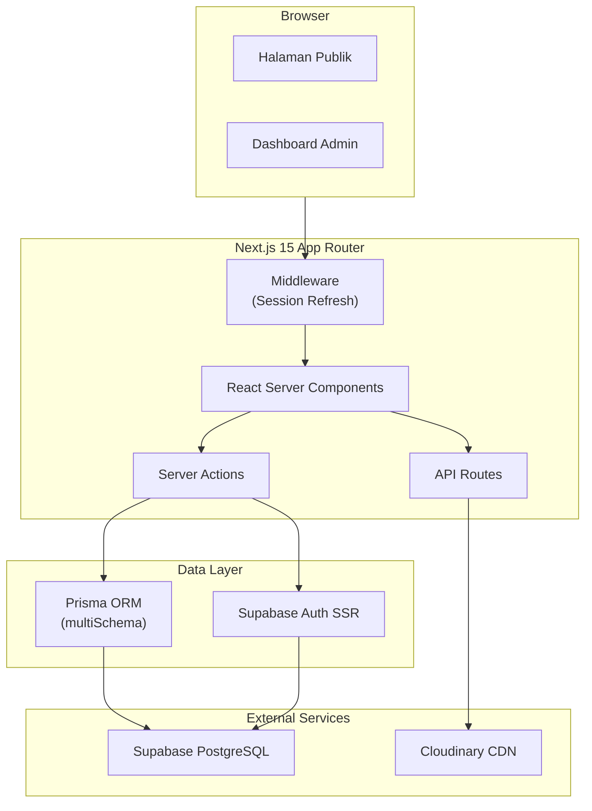
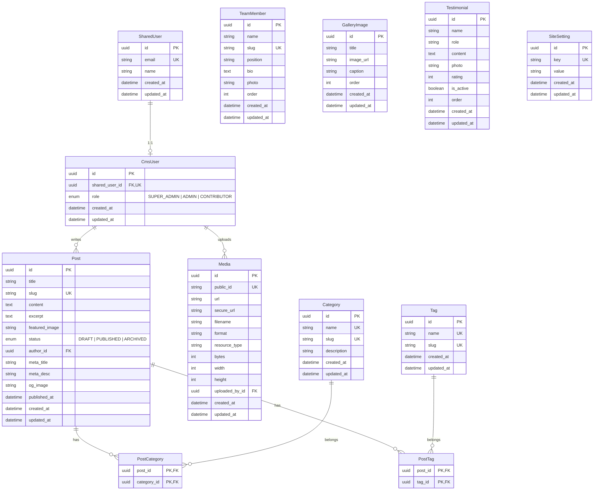
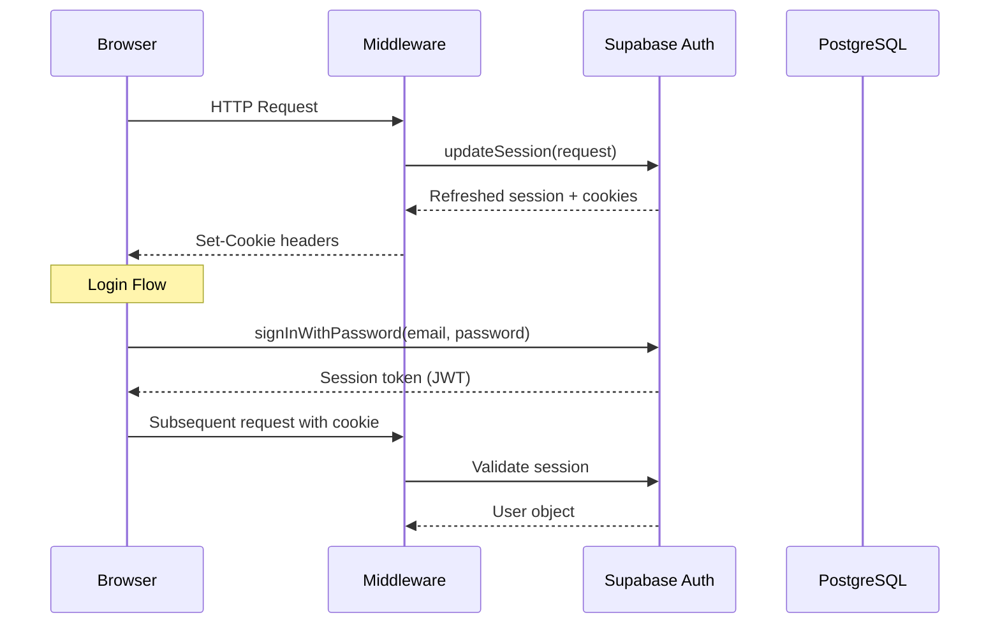
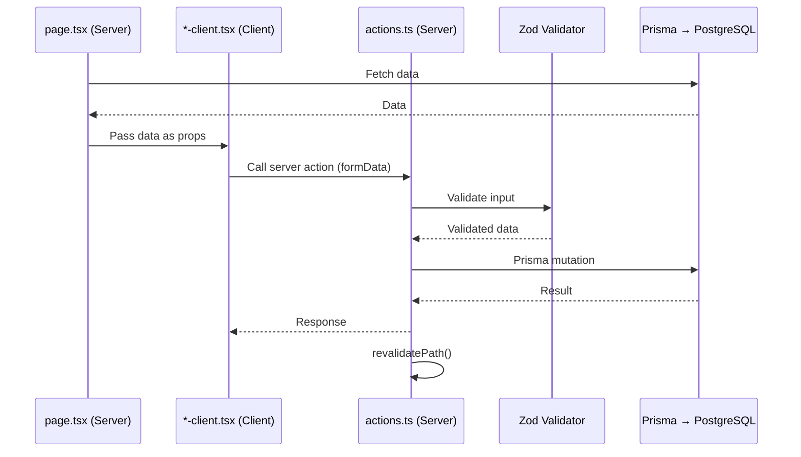
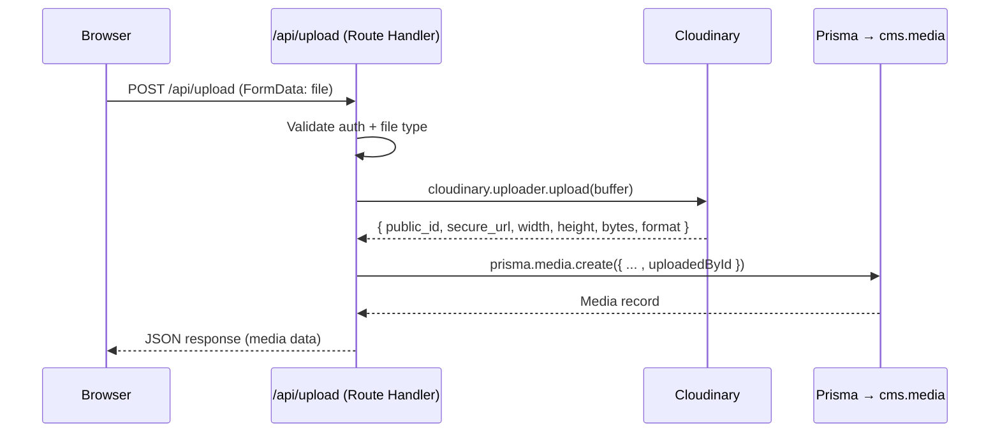
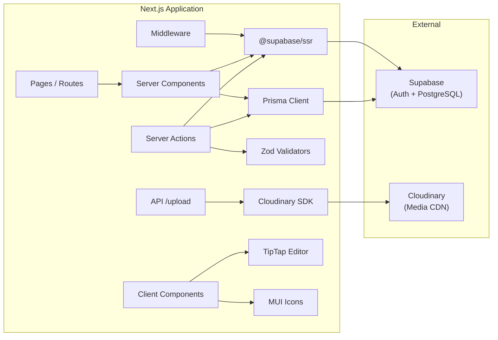

# Technical Design Document (TDD)

## Alfida Content Management System

| Field | Value |
| --- | --- |
| **Produk** | Alfida CMS |
| **Versi** | Alpha |
| **Tanggal** | 9 Agustus 2026 |
| **Referensi** | [PRD.md](./PRD.md) · [DESIGN.md](../DESIGN.md) · [PROJECTS.md](../PROJECTS.md) |

---

## 1. Gambaran Arsitektur

Alfida CMS dibangun sebagai aplikasi monolitik menggunakan Next.js 15 App Router. Sistem mengadopsi pola **server-first** — semua mutasi data dilakukan melalui Server Actions, autentikasi divalidasi di server-side, dan halaman publik dioptimasi dengan static/ISR rendering.


```mermaid
graph TB
    subgraph Client["Browser"]
        PUB["Halaman Publik"]
        ADMIN["Dashboard Admin"]
    end

    subgraph NextJS["Next.js 15 App Router"]
        MW["Middleware<br/>(Session Refresh)"]
        RSC["React Server Components"]
        SA["Server Actions"]
        API["API Routes"]
    end

    subgraph Data["Data Layer"]
        PRISMA["Prisma ORM<br/>(multiSchema)"]
        SUPA_AUTH["Supabase Auth SSR"]
    end

    subgraph External["External Services"]
        PG["Supabase PostgreSQL"]
        CDN["Cloudinary CDN"]
    end

    Client --> MW --> RSC
    RSC --> SA
    RSC --> API
    SA --> PRISMA
    SA --> SUPA_AUTH
    API --> CDN
    PRISMA --> PG
    SUPA_AUTH --> PG
```

---

## 2. Tech Stack Detail

| Layer | Teknologi | Versi | Catatan |
| --- | --- | --- | --- |
| **Runtime** | Node.js | ≥ 18 | Dengan Turbopack untuk dev server |
| **Framework** | Next.js | 15.3.4 | App Router, React Server Components |
| **UI Library** | React | 19.1.0 | Server & Client Components |
| **Styling** | Tailwind CSS | 4.x | CSS-based config (tanpa JS config file), `@tailwindcss/postcss` |
| **Database** | PostgreSQL | — | Via Supabase (multi-schema: `cms`, `shared`, `sim`) |
| **Auth** | Supabase Auth | SSR 0.7.0 | `@supabase/ssr` + `@supabase/supabase-js` 2.49.8 |
| **ORM** | Prisma | 6.9.0 | Preview feature: `multiSchema` |
| **Storage** | Cloudinary | 2.6.1 | Image & PDF upload/delivery |
| **Editor** | TipTap | 2.25.0 | Rich text, image insert, text-align, link, underline |
| **Validation** | Zod | 3.25.48 | Schema validation untuk semua form |
| **Icons** | MUI Icons | 7.1.0 | `@mui/icons-material` — emoji dilarang |
| **Package Manager** | pnpm | — | Lockfile: `pnpm-lock.yaml` |

---

## 3. Struktur Direktori

```
nextcms/
├── prisma/
│   ├── schema.prisma          # Prisma schema (multi-schema: cms, shared)
│   └── seed.ts                # Database seeding
├── src/
│   ├── app/
│   │   ├── (auth)/            # Route group: Login
│   │   │   ├── login/page.tsx
│   │   │   └── layout.tsx
│   │   ├── (public)/          # Route group: Halaman publik
│   │   │   ├── page.tsx       # / (Home)
│   │   │   ├── [slug]/page.tsx
│   │   │   ├── about/page.tsx
│   │   │   ├── blog/page.tsx
│   │   │   ├── contact/page.tsx
│   │   │   ├── gallery/page.tsx
│   │   │   ├── team/
│   │   │   │   ├── [slug]/page.tsx
│   │   │   │   └── page.tsx
│   │   │   ├── testimony/page.tsx
│   │   │   └── layout.tsx     # PublicHeader + PublicFooter
│   │   ├── admin/             # Route group: Dashboard admin
│   │   │   ├── appearance/    # page.tsx — Pengaturan tampilan
│   │   │   ├── categories/    # actions.ts + page.tsx
│   │   │   ├── dashboard/     # page.tsx
│   │   │   ├── gallery/       # page.tsx + new/ + [id]/edit/
│   │   │   ├── media/         # actions.ts + page.tsx
│   │   │   ├── menus/         # page.tsx
│   │   │   ├── posts/         # page.tsx + new/ + [id]/edit/
│   │   │   ├── profile/       # page.tsx — Profil user
│   │   │   ├── revisions/     # [entityType]/[entityId]/page.tsx
│   │   │   ├── settings/
│   │   │   │   ├── general/   # page.tsx — Settings umum
│   │   │   │   ├── permalinks/ # page.tsx — Pengaturan permalink
│   │   │   │   └── seo/       # page.tsx — Pengaturan SEO global
│   │   │   ├── tags/          # actions.ts + page.tsx
│   │   │   ├── team/          # page.tsx + new/ + [id]/edit/
│   │   │   ├── testimonials/  # page.tsx + new/ + [id]/edit/
│   │   │   ├── theme/
│   │   │   │   └── school-profile/  # Theme management
│   │   │   │       ├── page.tsx      # Overview
│   │   │   │       ├── about/page.tsx
│   │   │   │       ├── contact/page.tsx
│   │   │   │       ├── cta/page.tsx
│   │   │   │       ├── hero/page.tsx
│   │   │   │       ├── stats/page.tsx
│   │   │   │       ├── teachers/page.tsx
│   │   │   │       └── vision/page.tsx
│   │   │   ├── users/         # page.tsx + new/ + [id]/edit/
│   │   │   ├── layout.tsx     # Admin sidebar layout
│   │   │   └── page.tsx       # Dashboard overview
│   │   ├── api/
│   │   │   ├── posts/
│   │   │   │   └── check-slug/route.ts  # GET — Cek ketersediaan slug
│   │   │   └── upload/route.ts          # POST — Upload ke Cloudinary
│   │   ├── favicon.ico/route.ts   # Favicon handler
│   │   ├── sitemap.xml/route.ts   # Dynamic sitemap generator
│   │   ├── globals.css        # Tailwind v4 theme + design tokens
│   │   ├── layout.tsx         # Root layout
│   │   └── page.tsx           # Root page
│   ├── components/
│   │   ├── admin/             # Client components untuk dashboard
│   │   │   ├── categories-client.tsx
│   │   │   ├── dashboard-client.tsx
│   │   │   ├── gallery-client.tsx
│   │   │   ├── media-library-client.tsx
│   │   │   ├── post-editor.tsx
│   │   │   ├── post-list-client.tsx
│   │   │   ├── settings-client.tsx
│   │   │   ├── sidebar.tsx
│   │   │   ├── tags-client.tsx
│   │   │   ├── team-client.tsx
│   │   │   └── testimonials-client.tsx
│   │   └── public/            # Komponen halaman publik
│   │       ├── public-footer.tsx
│   │       └── public-header.tsx
│   ├── lib/
│   │   ├── cloudinary.ts      # Cloudinary v2 instance
│   │   ├── prisma.ts          # Prisma singleton client
│   │   └── supabase/
│   │       ├── client.ts      # Browser Supabase client
│   │       ├── middleware.ts   # Session refresh helper
│   │       └── server.ts      # Server Supabase client
│   ├── middleware.ts           # Next.js middleware (session refresh)
│   └── validators/            # Zod schemas
│       ├── category.ts
│       ├── gallery.ts
│       ├── post.ts
│       ├── settings.ts
│       ├── tag.ts
│       ├── team-member.ts
│       └── testimonial.ts
├── sistem-data/               # Konfigurasi credential (gitignored)
│   ├── claudinary-info.md
│   └── supabase-info.md
├── docs/
│   ├── ui/school-profile/     # Referensi desain halaman publik
│   ├── ui-wireframe/          # Wireframe dashboard admin
│   ├── PRD.md
│   ├── TDD.md                 # ← Dokumen ini
│   └── log.md
├── next.config.ts
├── tsconfig.json
├── postcss.config.mjs
└── package.json
```

---

## 4. Arsitektur Database

### 4.1. Multi-Schema Supabase

Prisma dikonfigurasi dengan preview feature `multiSchema` untuk mengakses beberapa schema dalam satu database Supabase PostgreSQL.

| Schema | Tujuan | Koneksi |
| --- | --- | --- |
| `cms` | Semua tabel CMS (posts, categories, tags, media, team, gallery, testimonials, settings, users, roles) | Via Transaction Pooler (port 6543) |
| `shared` | Tabel users yang di-share antar sistem, terhubung langsung ke Supabase Auth | Via Transaction Pooler |
| `sim` | Sistem Informasi Manajemen (sistem terpisah, tidak diakses oleh CMS) | — |

### 4.2. Entity-Relationship Diagram


```mermaid
erDiagram
    SharedUser ||--o| CmsUser : "1:1"
    CmsUser ||--o{ Post : "writes"
    CmsUser ||--o{ Media : "uploads"
    Post ||--o{ PostCategory : "has"
    Post ||--o{ PostTag : "has"
    Category ||--o{ PostCategory : "belongs"
    Tag ||--o{ PostTag : "belongs"

    SharedUser {
        uuid id PK
        string email UK
        string name
        datetime created_at
        datetime updated_at
    }

    CmsUser {
        uuid id PK
        uuid shared_user_id FK,UK
        enum role "SUPER_ADMIN | ADMIN | CONTRIBUTOR"
        datetime created_at
        datetime updated_at
    }

    Post {
        uuid id PK
        string title
        string slug UK
        text content
        text excerpt
        string featured_image
        enum status "DRAFT | PUBLISHED | ARCHIVED"
        uuid author_id FK
        string meta_title
        string meta_desc
        string og_image
        datetime published_at
        datetime created_at
        datetime updated_at
    }

    Category {
        uuid id PK
        string name UK
        string slug UK
        string description
        datetime created_at
        datetime updated_at
    }

    Tag {
        uuid id PK
        string name UK
        string slug UK
        datetime created_at
        datetime updated_at
    }

    PostCategory {
        uuid post_id PK,FK
        uuid category_id PK,FK
    }

    PostTag {
        uuid post_id PK,FK
        uuid tag_id PK,FK
    }

    Media {
        uuid id PK
        string public_id UK
        string url
        string secure_url
        string filename
        string format
        string resource_type
        int bytes
        int width
        int height
        uuid uploaded_by_id FK
        datetime created_at
        datetime updated_at
    }

    TeamMember {
        uuid id PK
        string name
        string slug UK
        string position
        text bio
        string photo
        int order
        datetime created_at
        datetime updated_at
    }

    GalleryImage {
        uuid id PK
        string title
        string image_url
        string caption
        int order
        datetime created_at
        datetime updated_at
    }

    Testimonial {
        uuid id PK
        string name
        string role
        text content
        string photo
        int rating
        boolean is_active
        int order
        datetime created_at
        datetime updated_at
    }

    SiteSetting {
        uuid id PK
        string key UK
        string value
        datetime created_at
        datetime updated_at
    }
```

### 4.3. Enum Definitions

| Enum | Values | Schema |
| --- | --- | --- |
| `CmsRole` | `SUPER_ADMIN`, `ADMIN`, `CONTRIBUTOR` | `cms` |
| `PostStatus` | `DRAFT`, `PUBLISHED`, `ARCHIVED` | `cms` |

---

## 5. Autentikasi & Otorisasi

### 5.1. Flow Autentikasi


```mermaid
sequenceDiagram
    participant B as Browser
    participant MW as Middleware
    participant SA as Supabase Auth
    participant DB as PostgreSQL

    B->>MW: HTTP Request
    MW->>SA: updateSession(request)
    SA-->>MW: Refreshed session + cookies
    MW-->>B: Set-Cookie headers

    Note over B: Login Flow
    B->>SA: signInWithPassword(email, password)
    SA-->>B: Session token (JWT)
    B->>MW: Subsequent request with cookie
    MW->>SA: Validate session
    SA-->>MW: User object
```

### 5.2. Komponen Auth

| File | Fungsi |
| --- | --- |
| `src/lib/supabase/server.ts` | Membuat Supabase client untuk Server Components & Server Actions. Membaca cookie dari `next/headers`. |
| `src/lib/supabase/client.ts` | Membuat Supabase client untuk Client Components (browser). |
| `src/lib/supabase/middleware.ts` | Helper `updateSession()` — refresh session JWT di setiap request. |
| `src/middleware.ts` | Next.js middleware yang memanggil `updateSession()`. Matcher mengecualikan file statis dan gambar. |

### 5.3. Otorisasi (Role-Based Access Control)

| Role | Hak Akses |
| --- | --- |
| `SUPER_ADMIN` | Akses penuh: semua CRUD, user management, settings, menus. |
| `ADMIN` | CRUD konten (post, media, team, gallery, testimonial), melihat semua media. |
| `CONTRIBUTOR` | Membuat/mengedit post miliknya sendiri, upload media (scoped per-user). |

> [!IMPORTANT]
> Setiap Server Action dan API route **wajib** memvalidasi autentikasi DAN otorisasi di server-side. Client-side guard hanya untuk UX — bukan sebagai security boundary.

### 5.4. Relasi User Antar Schema

```
Supabase Auth (auth.users)
        │
        ▼
  shared.users (SharedUser)
        │ 1:1
        ▼
    cms.users (CmsUser) ← role management
        │ 1:N
        ▼
  cms.posts / cms.media
```

Saat user login via Supabase Auth, ID-nya di-mapping ke `shared.users`, yang kemudian di-link ke `cms.users` untuk role CMS. Prisma relation `SharedUser ↔ CmsUser` menghubungkan kedua schema.

---

## 6. Routing & Rendering

### 6.1. Route Groups

Aplikasi menggunakan tiga route group Next.js App Router:

| Group | Path | Layout | Rendering |
| --- | --- | --- | --- |
| `(auth)` | `/login` | Auth layout (minimal, centered) | Client-side |
| `(public)` | `/`, `/about`, `/blog`, `/[slug]`, dll. | Public layout (`PublicHeader` + `PublicFooter`) | SSG / ISR |
| `admin` | `/admin/*` | Admin layout (Sidebar + Content area) | SSR (auth-gated) |

### 6.2. Peta Route Lengkap

#### Halaman Publik — `(public)`

| Route | File | Rendering | Data Source |
| --- | --- | --- | --- |
| `/` | `(public)/page.tsx` | ISR | Posts, Team, Gallery, Testimonials, Settings |
| `/about` | `(public)/about/page.tsx` | SSG/ISR | Settings, TeamMembers |
| `/contact` | `(public)/contact/page.tsx` | SSG/ISR | Settings |
| `/gallery` | `(public)/gallery/page.tsx` | ISR | GalleryImages |
| `/team` | `(public)/team/page.tsx` | ISR | TeamMembers |
| `/team/[slug]` | `(public)/team/[slug]/page.tsx` | SSG/ISR | TeamMember by slug |
| `/testimony` | `(public)/testimony/page.tsx` | ISR | Testimonials (isActive: true) |
| `/blog` | `(public)/blog/page.tsx` | ISR | Posts (status: PUBLISHED), Categories |
| `/[slug]` | `(public)/[slug]/page.tsx` | ISR | Post by slug |

#### Dashboard Admin — `admin`

##### Core

| Route | File | Tipe |
| --- | --- | --- |
| `/admin` | `admin/page.tsx` | Dashboard overview |
| `/admin/profile` | `admin/profile/page.tsx` | Profil user yang sedang login |

##### Content Management

| Route | File | Tipe |
| --- | --- | --- |
| `/admin/posts` | `admin/posts/page.tsx` | Daftar post |
| `/admin/posts/new` | `admin/posts/new/page.tsx` | Post editor (baru) |
| `/admin/posts/[id]/edit` | `admin/posts/[id]/edit/page.tsx` | Post editor (edit) |
| `/admin/categories` | `admin/categories/page.tsx` | CRUD kategori |
| `/admin/tags` | `admin/tags/page.tsx` | CRUD tags |
| `/admin/media` | `admin/media/page.tsx` | Media library (Cloudinary) |
| `/admin/revisions/[entityType]/[entityId]` | `admin/revisions/[entityType]/[entityId]/page.tsx` | Riwayat revisi per-entity |

##### Team, Gallery & Testimonials

| Route | File | Tipe |
| --- | --- | --- |
| `/admin/team` | `admin/team/page.tsx` | Daftar team member |
| `/admin/team/new` | `admin/team/new/page.tsx` | Tambah team member |
| `/admin/team/[id]/edit` | `admin/team/[id]/edit/page.tsx` | Edit team member |
| `/admin/gallery` | `admin/gallery/page.tsx` | Daftar galeri |
| `/admin/gallery/new` | `admin/gallery/new/page.tsx` | Tambah item galeri |
| `/admin/gallery/[id]/edit` | `admin/gallery/[id]/edit/page.tsx` | Edit item galeri |
| `/admin/testimonials` | `admin/testimonials/page.tsx` | Daftar testimonial |
| `/admin/testimonials/new` | `admin/testimonials/new/page.tsx` | Tambah testimonial |
| `/admin/testimonials/[id]/edit` | `admin/testimonials/[id]/edit/page.tsx` | Edit testimonial |

##### Theme Management

| Route | File | Tipe |
| --- | --- | --- |
| `/admin/theme/school-profile` | `admin/theme/school-profile/page.tsx` | Overview tema school profile |
| `/admin/theme/school-profile/hero` | `…/hero/page.tsx` | Pengaturan section Hero |
| `/admin/theme/school-profile/about` | `…/about/page.tsx` | Pengaturan section About |
| `/admin/theme/school-profile/vision` | `…/vision/page.tsx` | Pengaturan section Visi/Misi |
| `/admin/theme/school-profile/stats` | `…/stats/page.tsx` | Pengaturan section Statistik |
| `/admin/theme/school-profile/teachers` | `…/teachers/page.tsx` | Pengaturan section Teachers |
| `/admin/theme/school-profile/contact` | `…/contact/page.tsx` | Pengaturan section Contact |
| `/admin/theme/school-profile/cta` | `…/cta/page.tsx` | Pengaturan section Call-to-Action |

##### Settings & Appearance

| Route | File | Tipe |
| --- | --- | --- |
| `/admin/settings/general` | `admin/settings/general/page.tsx` | Settings umum (identitas, kontak) |
| `/admin/settings/permalinks` | `admin/settings/permalinks/page.tsx` | Pengaturan permalink / URL structure |
| `/admin/settings/seo` | `admin/settings/seo/page.tsx` | Pengaturan SEO global (Yoast-like) |
| `/admin/appearance` | `admin/appearance/page.tsx` | Pengaturan tampilan situs |
| `/admin/menus` | `admin/menus/page.tsx` | Pengaturan menu navigasi |

##### User Management

| Route | File | Tipe |
| --- | --- | --- |
| `/admin/users` | `admin/users/page.tsx` | Daftar user |
| `/admin/users/new` | `admin/users/new/page.tsx` | Tambah user baru |
| `/admin/users/[id]/edit` | `admin/users/[id]/edit/page.tsx` | Edit user / assign role |

#### Auth — `(auth)`

| Route | File |
| --- | --- |
| `/login` | `(auth)/login/page.tsx` |

#### API Routes

| Route | File | Method | Fungsi |
| --- | --- | --- | --- |
| `/api/upload` | `api/upload/route.ts` | POST | Upload file ke Cloudinary |
| `/api/posts/check-slug` | `api/posts/check-slug/route.ts` | GET | Cek ketersediaan slug post |

#### Generated Routes

| Route | File | Fungsi |
| --- | --- | --- |
| `/sitemap.xml` | `sitemap.xml/route.ts` | Dynamic XML sitemap generation |
| `/favicon.ico` | `favicon.ico/route.ts` | Favicon handler |

---

## 7. Data Layer

### 7.1. Prisma Client

```
src/lib/prisma.ts
```

Menggunakan singleton pattern untuk menghindari multiple Prisma client instances saat hot-reload di development:

```typescript
// Simplified pattern
const globalForPrisma = globalThis as unknown as { prisma: PrismaClient };
export const prisma = globalForPrisma.prisma ?? new PrismaClient();
if (process.env.NODE_ENV !== "production") globalForPrisma.prisma = prisma;
```

**Koneksi Database:**
- `DATABASE_URL` — Transaction Pooler (port 6543, via PgBouncer, untuk query reguler)
- `DIRECT_URL` — Direct connection (port 5432, untuk migrasi & introspeksi)

### 7.2. Server Actions Pattern

Setiap modul admin mengikuti pola yang konsisten:

```
src/app/admin/{module}/
├── actions.ts    ← Server Actions (create, update, delete)
└── page.tsx      ← Server Component (read data, pass ke client)
```

**Flow:**
1. `page.tsx` (Server Component) → Fetch data via Prisma → Pass ke Client Component sebagai props
2. Client Component memanggil Server Action dari `actions.ts` untuk mutasi
3. Server Action → Validasi Zod → Cek auth → Prisma mutation → `revalidatePath()`


```mermaid
sequenceDiagram
    participant Page as page.tsx (Server)
    participant Client as *-client.tsx (Client)
    participant Action as actions.ts (Server)
    participant Zod as Zod Validator
    participant DB as Prisma → PostgreSQL

    Page->>DB: Fetch data
    DB-->>Page: Data
    Page->>Client: Pass data as props

    Client->>Action: Call server action (formData)
    Action->>Zod: Validate input
    Zod-->>Action: Validated data
    Action->>DB: Prisma mutation
    DB-->>Action: Result
    Action-->>Client: Response
    Action->>Action: revalidatePath()
```

### 7.3. Validators (Zod Schemas)

Semua validator tersimpan di `src/validators/` dan digunakan oleh Server Actions:

| File | Schema | Digunakan Oleh |
| --- | --- | --- |
| `category.ts` | `CategoryFormSchema` | `admin/categories/actions.ts` |
| `tag.ts` | `TagFormSchema` | `admin/tags/actions.ts` |
| `post.ts` | `PostFormSchema` | `admin/posts/actions.ts` |
| `gallery.ts` | `GalleryImageFormSchema` | `admin/gallery/actions.ts` |
| `team-member.ts` | `TeamMemberFormSchema` | `admin/team/actions.ts` |
| `testimonial.ts` | `TestimonialFormSchema` | `admin/testimonials/actions.ts` |
| `settings.ts` | `SettingsFormSchema` | `admin/settings/actions.ts` |

---

## 8. Media & Storage

### 8.1. Arsitektur Upload


```mermaid
sequenceDiagram
    participant Browser
    participant API as /api/upload (Route Handler)
    participant CDN as Cloudinary
    participant DB as Prisma → cms.media

    Browser->>API: POST /api/upload (FormData: file)
    API->>API: Validate auth + file type
    API->>CDN: cloudinary.uploader.upload(buffer)
    CDN-->>API: { public_id, secure_url, width, height, bytes, format }
    API->>DB: prisma.media.create({ ... , uploadedById })
    DB-->>API: Media record
    API-->>Browser: JSON response (media data)
```

### 8.2. Cloudinary Configuration

| Env Variable | Deskripsi |
| --- | --- |
| `CLOUDINARY_CLOUD_NAME` | Nama cloud Cloudinary |
| `CLOUDINARY_API_KEY` | API key |
| `CLOUDINARY_API_SECRET` | API secret |

Konfigurasi berada di `src/lib/cloudinary.ts` menggunakan Cloudinary v2 SDK.

### 8.3. Image Delivery

- Gambar di halaman publik menggunakan `next/image` dengan `remotePatterns` yang mengizinkan `res.cloudinary.com`
- Cloudinary URL transformations digunakan untuk responsive sizing
- Media library menampilkan gambar scoped per-user (`uploadedById = currentUser.id`)

---

## 9. Komponen UI

### 9.1. Design System (Tailwind CSS v4)

Design tokens didefinisikan di `src/app/globals.css` menggunakan CSS custom properties dan `@theme` block Tailwind v4:

| Token | CSS Variable | Value |
| --- | --- | --- |
| Primary | `--color-primary` | #454545 |
| Secondary | `--color-secondary` | #06bfa2 |
| Tertiary | `--color-tertiary` | #0f7f6d |
| Neutral | `--color-neutral` | #F7F8F8 |
| Surface | `--color-surface` | #FFFFFF |
| On-Tertiary | `--color-on-tertiary` | #F7F8F8 |
| Border | `--color-border` | #E3E8E7 |

**Tipografi:**
- Heading: Roboto (Google Fonts)
- Body & Label: Inter (Google Fonts)

### 9.2. Component Architecture

```
src/components/
├── admin/                    # Dashboard client components
│   ├── sidebar.tsx           # Navigasi sidebar admin
│   ├── dashboard-client.tsx  # Statistik overview
│   ├── post-editor.tsx       # TipTap rich text editor
│   ├── post-list-client.tsx  # Daftar post dengan actions
│   ├── categories-client.tsx # CRUD kategori
│   ├── tags-client.tsx       # CRUD tags
│   ├── media-library-client.tsx # Upload & browse media
│   ├── team-client.tsx       # CRUD team member
│   ├── gallery-client.tsx    # CRUD galeri
│   ├── testimonials-client.tsx # CRUD testimoni
│   └── settings-client.tsx   # Form pengaturan situs
└── public/                   # Layout publik
    ├── public-header.tsx     # Header navigasi + logo
    └── public-footer.tsx     # Footer info yayasan
```

### 9.3. Post Editor (TipTap)

Editor menggunakan TipTap dengan extensions berikut:

| Extension | Package | Fungsi |
| --- | --- | --- |
| StarterKit | `@tiptap/starter-kit` | Heading, bold, italic, lists, blockquote, code, dll. |
| Image | `@tiptap/extension-image` | Insert gambar dari media library |
| Link | `@tiptap/extension-link` | Hyperlink |
| TextAlign | `@tiptap/extension-text-align` | Alignment teks (left, center, right, justify) |
| Underline | `@tiptap/extension-underline` | Teks underline |

**Fitur Editor:**
- Insert gambar dari media library (modal picker)
- Resize gambar dalam editor
- Atur alignment gambar (left, center, right)
- Toolbar: formatting, heading levels, lists, link, image, alignment

---

## 10. SEO & Metadata

### 10.1. Per-Post SEO Fields

| Field | Kolom DB | Deskripsi |
| --- | --- | --- |
| Meta Title | `meta_title` | Title tag override (default: post title) |
| Meta Description | `meta_desc` | Meta description untuk search engine |
| OG Image | `og_image` | Open Graph image URL |
| Slug | `slug` | URL-friendly identifier |

### 10.2. Global SEO (via SiteSetting)

Pengaturan global SEO disimpan sebagai key-value pairs di tabel `site_settings`:

| Key (contoh) | Deskripsi |
| --- | --- |
| `site_title` | Nama situs |
| `site_description` | Deskripsi default situs |
| `site_logo` | URL logo |
| `contact_email` | Email kontak |
| `contact_phone` | Nomor telepon |
| `contact_address` | Alamat |

### 10.3. Implementation

- `generateMetadata()` di setiap page untuk dynamic title & description
- Open Graph & Twitter Card tags otomatis
- Semantic HTML5 dengan heading hierarchy
- `sitemap.xml` dan `robots.txt` via Next.js metadata API

---

## 11. Environment Variables

| Variable | Scope | Deskripsi |
| --- | --- | --- |
| `NEXT_PUBLIC_SUPABASE_URL` | Public | Supabase project URL |
| `NEXT_PUBLIC_SUPABASE_ANON_KEY` | Public | Supabase anonymous key |
| `DATABASE_URL` | Server | Prisma connection (Transaction Pooler, port 6543) |
| `DIRECT_URL` | Server | Prisma direct connection (port 5432, untuk migrasi) |
| `CLOUDINARY_CLOUD_NAME` | Server | Cloudinary cloud name |
| `CLOUDINARY_API_KEY` | Server | Cloudinary API key |
| `CLOUDINARY_API_SECRET` | Server | Cloudinary API secret |

> [!CAUTION]
> Semua variabel server-only (tanpa prefix `NEXT_PUBLIC_`) tidak boleh di-expose ke client. File `.env.local` harus tetap di `.gitignore`. Credential referensi tersimpan di `sistem-data/` (juga gitignored).

---

## 12. Middleware & Security

### 12.1. Next.js Middleware

```typescript
// src/middleware.ts
export async function middleware(request: NextRequest) {
  return await updateSession(request);
}

export const config = {
  matcher: [
    "/((?!_next/static|_next/image|favicon.ico|.*\\.(?:svg|png|jpg|jpeg|gif|webp)$).*)",
  ],
};
```

**Fungsi:** Refresh session Supabase Auth di setiap request. Matcher mengecualikan file statis dan gambar.

### 12.2. Security Checklist

| Aspek | Implementasi |
| --- | --- |
| Input Validation | Zod schema di setiap Server Action |
| Auth Check | `createClient()` → `getUser()` di setiap Server Action |
| RBAC | Cek `CmsRole` sebelum operasi sensitif |
| CSRF | Built-in protection dari Next.js Server Actions |
| Secret Management | `.env.local` (gitignored) + `sistem-data/` |
| SQL Injection | Prisma parameterized queries |
| XSS | React auto-escaping + sanitized TipTap output |

---

## 13. Build & Deployment

### 13.1. Build Pipeline

```bash
# Build command (defined in package.json)
prisma generate && next build
```

**Urutan:**
1. `prisma generate` — Generate Prisma Client dari schema
2. `next build` — Build Next.js application (SSG pages, route handlers, etc.)

### 13.2. Scripts

| Script | Perintah | Fungsi |
| --- | --- | --- |
| `dev` | `next dev --turbopack` | Development server dengan Turbopack |
| `build` | `prisma generate && next build` | Production build |
| `start` | `next start` | Start production server |
| `lint` | `next lint` | ESLint check |
| `postinstall` | `prisma generate` | Auto-generate Prisma client setelah install |

### 13.3. TypeScript Configuration

| Setting | Value | Catatan |
| --- | --- | --- |
| `target` | ES2017 | Kompatibilitas Node.js 18+ |
| `strict` | true | Strict mode TypeScript |
| `module` | esnext | ES modules |
| `moduleResolution` | bundler | Bundler-style resolution |
| `paths` | `@/* → ./src/*` | Path alias |

---

## 14. Rendering Strategy

| Tipe Halaman | Strategy | Revalidation |
| --- | --- | --- |
| Halaman publik statis (`/about`, `/contact`) | SSG / ISR | Revalidate on content change |
| Halaman publik dinamis (`/blog`, `/[slug]`, `/team`) | ISR | `revalidatePath()` dari Server Action |
| Dashboard admin | SSR | Setiap request (auth-gated) |
| Auth pages | Client-side | — |

---

## 15. Referensi Desain

### 15.1. Wireframe Dashboard Admin

Tersimpan di `docs/ui-wireframe/` sebagai file HTML:

| File | Halaman |
| --- | --- |
| `login.html` | Login |
| `dashboard.html` | Dashboard overview |
| `post-list.html` | Daftar post |
| `post-editor.html` | Post editor |
| `categories.html` | Manajemen kategori |
| `tags.html` | Manajemen tags |
| `media-library.html` | Media library |
| `menus.html` | Pengaturan menu |
| `settings-general.html` | Settings umum |
| `users.html` | User management |
| `revisions.html` | Post revisions |

### 15.2. Desain Halaman Publik

Tersimpan di `docs/ui/school-profile/` sebagai file HTML:

| File | Halaman |
| --- | --- |
| `home.html` | Home (hero, info boxes, about, stats, teachers, gallery, testimonial, news, CTA) |
| `about-us.html` | About Us |
| `contact.html` | Contact |
| `gallery.html` | Gallery |
| `team.html` | Team / Teachers |
| `team-detail.html` | Team Detail |
| `testimony.html` | Testimonials |
| `archive.html` | Blog archive |
| `single-post.html` | Single post / berita |
| `search-result-page.html` | Hasil pencarian |
| `404-page.html` | 404 Not Found |
| `coming-soon-page.html` | Coming Soon |

---

## 16. Status Implementasi Modul

### 16.1. Modul Sudah Diimplementasi

| Modul | Path | Catatan |
| --- | --- | --- |
| **Posts** (CRUD) | `admin/posts/` | List, create, edit dengan TipTap editor |
| **Categories** | `admin/categories/` | CRUD lengkap |
| **Tags** | `admin/tags/` | CRUD lengkap |
| **Media Library** | `admin/media/` | Upload Cloudinary, scoped per-user |
| **Team** (CRUD) | `admin/team/` | List, create (`new/`), edit (`[id]/edit/`) |
| **Gallery** (CRUD) | `admin/gallery/` | List, create (`new/`), edit (`[id]/edit/`) |
| **Testimonials** (CRUD) | `admin/testimonials/` | List, create (`new/`), edit (`[id]/edit/`) |
| **Users** (CRUD) | `admin/users/` | List, create (`new/`), edit / role assign (`[id]/edit/`) |
| **Settings General** | `admin/settings/general/` | Identitas dan kontak yayasan |
| **Settings SEO** | `admin/settings/seo/` | Pengaturan SEO global |
| **Settings Permalinks** | `admin/settings/permalinks/` | Pengaturan URL structure |
| **Theme Management** | `admin/theme/school-profile/` | Section-by-section management (hero, about, vision, stats, teachers, contact, CTA) |
| **Profile** | `admin/profile/` | Profil user yang login |
| **Appearance** | `admin/appearance/` | Pengaturan tampilan |
| **Revisions** | `admin/revisions/[entityType]/[entityId]/` | Riwayat revisi entity |
| **Sitemap** | `sitemap.xml/route.ts` | Dynamic XML sitemap |
| **Slug Check API** | `api/posts/check-slug/` | Validasi ketersediaan slug |

### 16.2. Modul Masih Perlu Pengembangan

| Modul | Status | Path | Catatan |
| --- | --- | --- | --- |
| **Menus** | Ada route, perlu validasi | `admin/menus/page.tsx` | Perlu review apakah CRUD navigation menu sudah lengkap |
| **Search** | Belum | — | Wireframe `search-result-page.html` ada, implementasi route belum |
| **Halaman Publik** | Partial | `(public)/` | Home sudah implementasi, halaman lain perlu review kelengkapan data |
| **`.env.example`** | Belum | — | Template env belum dibuat |

---

## 17. Dependency Graph


```mermaid
graph LR
    subgraph External
        Supabase["Supabase<br/>(Auth + PostgreSQL)"]
        Cloudinary["Cloudinary<br/>(Media CDN)"]
    end

    subgraph App["Next.js Application"]
        MW["Middleware"] --> SupaLib["@supabase/ssr"]
        Pages["Pages / Routes"] --> RSC["Server Components"]
        RSC --> Prisma["Prisma Client"]
        RSC --> SupaLib
        Actions["Server Actions"] --> Prisma
        Actions --> Validators["Zod Validators"]
        Actions --> SupaLib
        Upload["API /upload"] --> CloudLib["Cloudinary SDK"]
        Components["Client Components"] --> TipTap["TipTap Editor"]
        Components --> MUI["MUI Icons"]
    end

    SupaLib --> Supabase
    Prisma --> Supabase
    CloudLib --> Cloudinary
```

---

## 18. Konvensi Kode

| Aspek | Konvensi |
| --- | --- |
| **Nama file** | `kebab-case.tsx` |
| **Nama komponen** | `PascalCase` |
| **Nama variabel** | `camelCase` |
| **Nama env var** | `SCREAMING_SNAKE_CASE` |
| **Import order** | External → Internal (`@/`) → Relative (`./`) |
| **Path alias** | `@/*` → `./src/*` |
| **Server Actions** | `"use server"` di top-level `actions.ts` per modul |
| **Client Components** | `"use client"` di top-level, suffix `-client.tsx` |
| **Validators** | Satu file per entity di `src/validators/` |
| **Commit** | Conventional Commits (`feat:`, `fix:`, `chore:`) |
