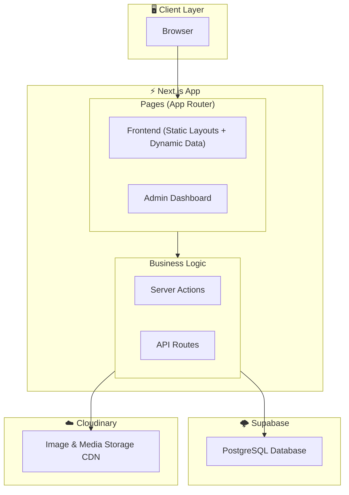

# 🏗️ Tech Design Document (TDD)

## **SIM Alfida — Content Management System**

> Dokumen teknis yang menjabarkan arsitektur, stack teknologi, routing, serta estimasi pengerjaan per modul untuk pengembangan SIM Yayasan Alfida.

| Dokumen | Detail |
|---|---|
| **Referensi** | [PRD.md](./PRD.md) |
| **Versi** | 2.0 (Pivot) |

---

## Daftar Isi

1. [Tech Stack & Dependencies](#1-tech-stack--dependencies)
2. [Arsitektur Aplikasi](#2-arsitektur-aplikasi)
3. [Arsitektur Folder](#3-arsitektur-folder)
4. [Database Design](#4-database-design)
5. [Auth Strategy](#5-auth-strategy)
6. [Routes — Pages (App Router)](#6-routes--pages-app-router)
7. [Routes — API & Server Actions](#7-routes--api--server-actions)

---

## 1. Tech Stack & Dependencies

### 1.1 Core Dependencies
- `next` (^14.2): Framework fullstack (App Router)
- `react` / `react-dom` (^18.3): UI library
- `typescript` (^5.5): Type safety

### 1.2 Data Layer
- **ORM:** Prisma
- **Database:** PostgreSQL (via Supabase)
- **Architecture:** Multi-schema architecture. The CMS tables are isolated within a custom `cms` schema instead of the default `public` schema. This is configured via Prisma's `multiSchema` preview feature and setting `schemas = ["cms"]` in `schema.prisma`.
- **Media Storage:** Cloudinary` (^2.x): Manajemen dan CDN aset gambar (Hero image, Galeri, Avatar Tim).

### 1.4 Authentication
- `next-auth` (^4.24): Auth framework (credentials provider)
- `bcryptjs`: Password hashing

### 1.5 UI & Styling
- `tailwindcss` (^3.4): Utility-first CSS
- `shadcn/ui`: Component library
- `@mui/icons-material`: Icon library

### 1.6 Utility & State
- `zod`: Schema validation
- `@tiptap/react`: Rich Text Editor (headless)
- `@tanstack/react-query`: Client-side data fetching

---

## 2. Arsitektur Aplikasi


```mermaid
graph TB
    subgraph Client["🖥️ Client Layer"]
        Browser["Browser"]
    end

    subgraph NextJS["⚡ Next.js App"]
        subgraph Pages["Pages (App Router)"]
            PublicPages["Frontend (Static Layouts + Dynamic Data)"]
            AdminDashboard["Admin Dashboard"]
        end

        subgraph Logic["Business Logic"]
            ServerActions["Server Actions"]
            APIRoutes["API Routes"]
        end
    end

    subgraph Supabase["🌩️ Supabase"]
        PostgreSQL["PostgreSQL Database"]
    end
    
    subgraph Cloudinary["☁️ Cloudinary"]
        MediaStorage["Image & Media Storage CDN"]
    end

    Browser --> Pages
    Pages --> Logic
    Logic --> PostgreSQL
    Logic --> MediaStorage
```

---

## 3. Arsitektur Folder

```text
src/
├── actions/         # Server Actions (CRUD Posts, Team, Gallery)
├── app/
│   ├── (public)/    # Frontend Yayasan Alfida (Home, About, Team, Gallery)
│   ├── admin/       # Dashboard Admin (Posts, Media, Settings, Team)
│   └── api/         # Route Handlers (Upload to Cloudinary, Auth)
├── components/
│   ├── admin/       # UI Admin (Sidebar, Editor)
│   ├── ui/          # Komponen shadcn/UI
│   └── alfida/      # Komponen Frontend khusus Alfida
├── lib/
│   ├── cloudinary.ts# Cloudinary config
│   ├── prisma.ts    # Prisma client singleton
│   └── validators/  # Skema validasi Zod
└── styles/
    └── globals.css  # Tema berdasarkan docs/DESIGN.md
```

---

## 4. Konfigurasi Khusus (Cloudinary & Supabase)

### 4.1 Prisma + Supabase
Prisma akan dikonfigurasi menggunakan PostgreSQL. Variabel lingkungan harus membedakan antara koneksi *pooling* untuk transaksi biasa (`DATABASE_URL`) dan koneksi langsung untuk migrasi (`DIRECT_URL`).

### 4.2 Cloudinary Upload Action
Upload file akan diproses oleh `src/app/api/upload/route.ts` yang akan meneruskan form data ke Cloudinary API menggunakan SDK Node.js, mengembalikan URL absolut dari CDN Cloudinary untuk disimpan di database.

---

## 5. Auth Strategy
Autentikasi menggunakan **NextAuth.js** (Credentials Provider). Session dienkripsi dan disimpan dalam cookie.
Role yang didukung: `ADMIN` (akses penuh), `EDITOR` (tulis berita), `AUTHOR` (tulis berita sendiri).

---

## 6. Routes — Pages (App Router)

### 6.1 Frontend (Public)
Rute-rute ini didefinisikan secara eksplisit, bukan melalui dynamic routing tabel Pages:
- `/` - Beranda
- `/about` - Tentang Kami
- `/contact` - Hubungi Kami
- `/gallery` - Galeri Kegiatan
- `/team` - Tim Pengajar
- `/team/[slug]` - Detail Guru
- `/testimony` - Testimoni
- `/blog` - Daftar Artikel/Berita
- `/[slug]` - Detail Artikel/Berita

### 6.2 Admin (Protected)
- `/admin` - Dashboard Statistik
- `/admin/posts` - CRUD Berita
- `/admin/media` - Manajemen Cloudinary Media
- `/admin/team` - CRUD Guru & Staff
- `/admin/gallery` - CRUD Album Foto
- `/admin/testimonials` - CRUD Testimoni
- `/admin/settings` - Konfigurasi situs (identitas, kontak)
