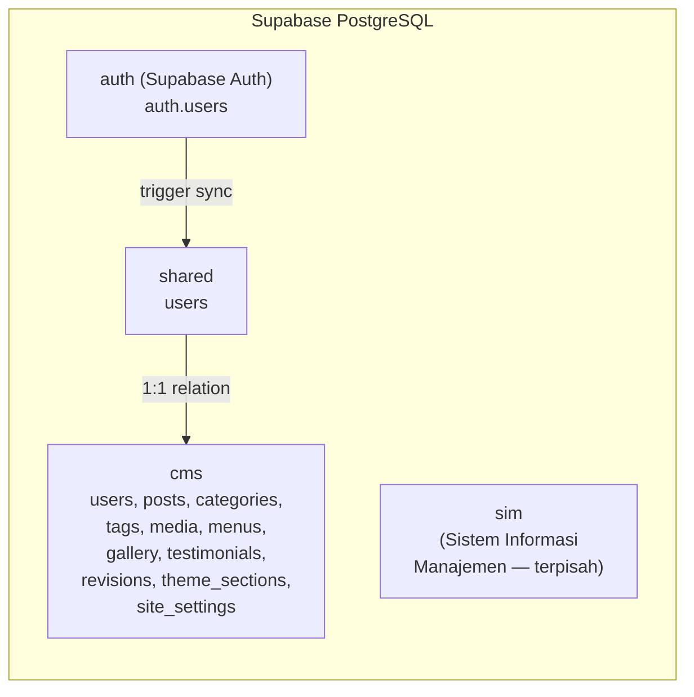

# Database Schema Documentation

## Alfida Content Management System

| Field | Value |
| --- | --- |
| **Produk** | Alfida CMS |
| **Versi** | Alpha |
| **Tanggal** | 9 Agustus 2026 |
| **ORM** | Prisma 6.9.0 (`multiSchema` preview feature) |
| **Database** | PostgreSQL (Supabase) |
| **Referensi** | [PRD.md](./PRD.md) · [TDD.md](./TDD.md) |

---

## 1. Arsitektur Multi-Schema

Sistem menggunakan satu database PostgreSQL Supabase dengan beberapa schema yang dipisahkan berdasarkan domain:



| Schema | Fungsi | Diakses oleh CMS |
| --- | --- | --- |
| `auth` | Supabase Auth internal (auth.users) | Tidak langsung — melalui Supabase Auth SDK |
| `shared` | Informasi user yang di-share antar sistem | Ya — via Prisma (`SharedUser`) |
| `cms` | Semua tabel khusus CMS | Ya — via Prisma (semua model CMS) |
| `sim` | Sistem Informasi Manajemen | Tidak — diakses oleh sistem lain |

### Koneksi Database

| Variabel | URL | Tujuan |
| --- | --- | --- |
| `DATABASE_URL` | `postgresql://...pooler.supabase.com:6543/postgres?pgbouncer=true&schema=cms` | Transaction Pooler (query reguler) |
| `DIRECT_URL` | `postgresql://...pooler.supabase.com:5432/postgres?schema=cms` | Direct connection (migrasi & introspeksi) |

---

## 2. Entity-Relationship Diagram

```mermaid
erDiagram
    SharedUser ||--o| CmsUser : "1:1"
    CmsUser ||--o{ Post : "writes"
    CmsUser ||--o{ Media : "uploads"
    Post ||--o{ PostCategory : "has"
    Post ||--o{ PostTag : "has"
    Post ||--o{ Revision : "has"
    Category ||--o{ PostCategory : "belongs"
    Tag ||--o{ PostTag : "belongs"
    GalleryAlbum ||--o{ GalleryImage : "contains"
    Menu ||--o{ MenuItem : "has"
    MenuItem ||--o{ MenuItem : "parent-child"

    SharedUser {
        uuid id PK
        string email UK
        string name
        string avatar
        datetime created_at
        datetime updated_at
    }

    CmsUser {
        uuid id PK
        uuid shared_user_id FK_UK
        enum role
        datetime created_at
        datetime updated_at
    }

    Post {
        uuid id PK
        string title
        string slug UK
        text content
        text excerpt
        string featured_image
        enum status
        uuid author_id FK
        string meta_title
        text meta_desc
        string og_image
        datetime published_at
        datetime created_at
        datetime updated_at
    }

    Category {
        uuid id PK
        string name UK
        string slug UK
        text description
        datetime created_at
        datetime updated_at
    }

    Tag {
        uuid id PK
        string name UK
        string slug UK
        datetime created_at
        datetime updated_at
    }

    PostCategory {
        uuid post_id PK_FK
        uuid category_id PK_FK
    }

    PostTag {
        uuid post_id PK_FK
        uuid tag_id PK_FK
    }

    Media {
        uuid id PK
        string public_id UK
        string url
        string secure_url
        string filename
        string format
        string resource_type
        int bytes
        int width
        int height
        uuid uploaded_by_id FK
        datetime created_at
        datetime updated_at
    }

    TeamMember {
        uuid id PK
        string name
        string slug UK
        string position
        text bio
        string photo
        int order
        boolean is_active
        datetime created_at
        datetime updated_at
    }

    GalleryAlbum {
        uuid id PK
        string name UK
        string slug UK
        text description
        string cover_image
        int order
        datetime created_at
        datetime updated_at
    }

    GalleryImage {
        uuid id PK
        string title
        string image_url
        text caption
        uuid album_id FK
        int order
        datetime created_at
        datetime updated_at
    }

    Testimonial {
        uuid id PK
        string name
        string role
        text content
        string photo
        int rating
        boolean is_active
        int order
        datetime created_at
        datetime updated_at
    }

    SiteSetting {
        uuid id PK
        string key UK
        text value
        string group
        datetime created_at
        datetime updated_at
    }

    Menu {
        uuid id PK
        string name UK
        string slug UK
        string location
        datetime created_at
        datetime updated_at
    }

    MenuItem {
        uuid id PK
        uuid menu_id FK
        string label
        string url
        string target
        uuid parent_id FK
        int order
    }

    Revision {
        uuid id PK
        string entity_type
        uuid entity_id FK
        text data
        uuid author_id FK
        datetime created_at
    }

    ThemeSection {
        uuid id PK
        string theme
        string section
        text data
        datetime updated_at
    }
```

---

## 3. Detail Tabel Per Schema

### 3.1. Schema: `shared`

#### `shared.users` — SharedUser

Tabel user yang di-share antar sistem (CMS, SIM, dll). Terhubung langsung dengan Supabase Auth.

| Kolom | Tipe | Constraint | Default | Deskripsi |
| --- | --- | --- | --- | --- |
| `id` | `UUID` | PK | `uuid()` | ID user, sinkron dengan Supabase Auth |
| `email` | `VARCHAR` | UNIQUE, NOT NULL | — | Alamat email |
| `name` | `VARCHAR` | NULLABLE | — | Nama lengkap |
| `avatar` | `VARCHAR` | NULLABLE | — | URL foto profil |
| `created_at` | `TIMESTAMP` | NOT NULL | `now()` | Waktu dibuat |
| `updated_at` | `TIMESTAMP` | NOT NULL | auto | Waktu terakhir diubah |

**Relasi:**
- `SharedUser` → `CmsUser` (1:1, opsional)

---

### 3.2. Schema: `cms`

#### `cms.users` — CmsUser

User CMS dengan role assignment. Setiap CmsUser terhubung 1:1 ke SharedUser.

| Kolom | Tipe | Constraint | Default | Deskripsi |
| --- | --- | --- | --- | --- |
| `id` | `UUID` | PK | `uuid()` | ID user CMS |
| `shared_user_id` | `UUID` | FK → `shared.users(id)`, UNIQUE | — | Link ke SharedUser |
| `role` | `CmsRole` | NOT NULL | `CONTRIBUTOR` | Role user dalam CMS |
| `created_at` | `TIMESTAMP` | NOT NULL | `now()` | Waktu dibuat |
| `updated_at` | `TIMESTAMP` | NOT NULL | auto | Waktu terakhir diubah |

**Relasi:**
- `CmsUser` → `SharedUser` (1:1, wajib)
- `CmsUser` → `Post[]` (1:N)
- `CmsUser` → `Media[]` (1:N)

---

#### `cms.posts` — Post

Konten utama CMS: berita, pengumuman, artikel.

| Kolom | Tipe | Constraint | Default | Deskripsi |
| --- | --- | --- | --- | --- |
| `id` | `UUID` | PK | `uuid()` | ID post |
| `title` | `VARCHAR` | NOT NULL | — | Judul post |
| `slug` | `VARCHAR` | UNIQUE, NOT NULL | — | URL slug |
| `content` | `TEXT` | NULLABLE | — | Konten HTML (dari TipTap) |
| `excerpt` | `TEXT` | NULLABLE | — | Ringkasan post |
| `featured_image` | `VARCHAR` | NULLABLE | — | URL gambar utama (Cloudinary) |
| `status` | `PostStatus` | NOT NULL | `DRAFT` | Status publikasi |
| `author_id` | `UUID` | FK → `cms.users(id)`, NOT NULL | — | Penulis post |
| `meta_title` | `VARCHAR` | NULLABLE | — | SEO: Override title tag |
| `meta_desc` | `TEXT` | NULLABLE | — | SEO: Meta description |
| `og_image` | `VARCHAR` | NULLABLE | — | SEO: Open Graph image URL |
| `published_at` | `TIMESTAMP` | NULLABLE | — | Waktu dipublikasikan |
| `created_at` | `TIMESTAMP` | NOT NULL | `now()` | Waktu dibuat |
| `updated_at` | `TIMESTAMP` | NOT NULL | auto | Waktu terakhir diubah |

**Relasi:**
- `Post` → `CmsUser` (N:1, wajib) — author
- `Post` → `PostCategory[]` (1:N) — many-to-many ke Category
- `Post` → `PostTag[]` (1:N) — many-to-many ke Tag
- `Post` → `Revision[]` (1:N) — riwayat revisi

**Index:** `slug` (UNIQUE)

---

#### `cms.categories` — Category

Klasifikasi post berdasarkan kategori.

| Kolom | Tipe | Constraint | Default | Deskripsi |
| --- | --- | --- | --- | --- |
| `id` | `UUID` | PK | `uuid()` | ID kategori |
| `name` | `VARCHAR` | UNIQUE, NOT NULL | — | Nama kategori |
| `slug` | `VARCHAR` | UNIQUE, NOT NULL | — | URL slug |
| `description` | `TEXT` | NULLABLE | — | Deskripsi kategori |
| `created_at` | `TIMESTAMP` | NOT NULL | `now()` | Waktu dibuat |
| `updated_at` | `TIMESTAMP` | NOT NULL | auto | Waktu terakhir diubah |

**Relasi:**
- `Category` → `PostCategory[]` (1:N)

---

#### `cms.tags` — Tag

Label/tag untuk post.

| Kolom | Tipe | Constraint | Default | Deskripsi |
| --- | --- | --- | --- | --- |
| `id` | `UUID` | PK | `uuid()` | ID tag |
| `name` | `VARCHAR` | UNIQUE, NOT NULL | — | Nama tag |
| `slug` | `VARCHAR` | UNIQUE, NOT NULL | — | URL slug |
| `created_at` | `TIMESTAMP` | NOT NULL | `now()` | Waktu dibuat |
| `updated_at` | `TIMESTAMP` | NOT NULL | auto | Waktu terakhir diubah |

**Relasi:**
- `Tag` → `PostTag[]` (1:N)

---

#### `cms.post_categories` — PostCategory

Tabel pivot many-to-many antara Post dan Category.

| Kolom | Tipe | Constraint | Default | Deskripsi |
| --- | --- | --- | --- | --- |
| `post_id` | `UUID` | PK, FK → `cms.posts(id)` ON DELETE CASCADE | — | ID post |
| `category_id` | `UUID` | PK, FK → `cms.categories(id)` ON DELETE CASCADE | — | ID kategori |

**Composite Primary Key:** `(post_id, category_id)`

---

#### `cms.post_tags` — PostTag

Tabel pivot many-to-many antara Post dan Tag.

| Kolom | Tipe | Constraint | Default | Deskripsi |
| --- | --- | --- | --- | --- |
| `post_id` | `UUID` | PK, FK → `cms.posts(id)` ON DELETE CASCADE | — | ID post |
| `tag_id` | `UUID` | PK, FK → `cms.tags(id)` ON DELETE CASCADE | — | ID tag |

**Composite Primary Key:** `(post_id, tag_id)`

---

#### `cms.media` — Media

Record file media yang diupload ke Cloudinary.

| Kolom | Tipe | Constraint | Default | Deskripsi |
| --- | --- | --- | --- | --- |
| `id` | `UUID` | PK | `uuid()` | ID media |
| `public_id` | `VARCHAR` | UNIQUE, NOT NULL | — | Cloudinary public ID |
| `url` | `VARCHAR` | NOT NULL | — | URL HTTP |
| `secure_url` | `VARCHAR` | NOT NULL | — | URL HTTPS |
| `filename` | `VARCHAR` | NOT NULL | — | Nama file asli |
| `format` | `VARCHAR` | NULLABLE | — | Format file (jpg, png, pdf, dll.) |
| `resource_type` | `VARCHAR` | NOT NULL | `"image"` | Tipe resource Cloudinary |
| `bytes` | `INT` | NULLABLE | — | Ukuran file dalam bytes |
| `width` | `INT` | NULLABLE | — | Lebar gambar (px) |
| `height` | `INT` | NULLABLE | — | Tinggi gambar (px) |
| `uploaded_by_id` | `UUID` | FK → `cms.users(id)`, NOT NULL | — | User yang mengupload |
| `created_at` | `TIMESTAMP` | NOT NULL | `now()` | Waktu diupload |
| `updated_at` | `TIMESTAMP` | NOT NULL | auto | Waktu terakhir diubah |

**Relasi:**
- `Media` → `CmsUser` (N:1, wajib) — uploader

> [!NOTE]
> Media library menampilkan gambar **scoped per-user** — user hanya melihat media yang dia upload sendiri (filter: `uploaded_by_id = currentUser.id`).

---

#### `cms.team_members` — TeamMember

Profil guru/staff yayasan.

| Kolom | Tipe | Constraint | Default | Deskripsi |
| --- | --- | --- | --- | --- |
| `id` | `UUID` | PK | `uuid()` | ID anggota tim |
| `name` | `VARCHAR` | NOT NULL | — | Nama lengkap |
| `slug` | `VARCHAR` | UNIQUE, NOT NULL | — | URL slug (untuk halaman detail) |
| `position` | `VARCHAR` | NOT NULL | — | Jabatan / posisi |
| `bio` | `TEXT` | NULLABLE | — | Biografi |
| `photo` | `VARCHAR` | NULLABLE | — | URL foto (Cloudinary) |
| `order` | `INT` | NOT NULL | `0` | Urutan tampil |
| `is_active` | `BOOLEAN` | NOT NULL | `true` | Status aktif/nonaktif |
| `created_at` | `TIMESTAMP` | NOT NULL | `now()` | Waktu dibuat |
| `updated_at` | `TIMESTAMP` | NOT NULL | auto | Waktu terakhir diubah |

---

#### `cms.gallery_albums` — GalleryAlbum

Album untuk mengelompokkan foto galeri.

| Kolom | Tipe | Constraint | Default | Deskripsi |
| --- | --- | --- | --- | --- |
| `id` | `UUID` | PK | `uuid()` | ID album |
| `name` | `VARCHAR` | UNIQUE, NOT NULL | — | Nama album |
| `slug` | `VARCHAR` | UNIQUE, NOT NULL | — | URL slug |
| `description` | `TEXT` | NULLABLE | — | Deskripsi album |
| `cover_image` | `VARCHAR` | NULLABLE | — | URL cover image (Cloudinary) |
| `order` | `INT` | NOT NULL | `0` | Urutan tampil |
| `created_at` | `TIMESTAMP` | NOT NULL | `now()` | Waktu dibuat |
| `updated_at` | `TIMESTAMP` | NOT NULL | auto | Waktu terakhir diubah |

**Relasi:**
- `GalleryAlbum` → `GalleryImage[]` (1:N)

---

#### `cms.gallery_images` — GalleryImage

Foto kegiatan dalam galeri, bisa dikelompokkan dalam album.

| Kolom | Tipe | Constraint | Default | Deskripsi |
| --- | --- | --- | --- | --- |
| `id` | `UUID` | PK | `uuid()` | ID gambar |
| `title` | `VARCHAR` | NULLABLE | — | Judul gambar |
| `image_url` | `VARCHAR` | NOT NULL | — | URL gambar (Cloudinary) |
| `caption` | `TEXT` | NULLABLE | — | Keterangan gambar |
| `album_id` | `UUID` | FK → `cms.gallery_albums(id)`, NULLABLE | — | Album tempat gambar berada |
| `order` | `INT` | NOT NULL | `0` | Urutan tampil |
| `created_at` | `TIMESTAMP` | NOT NULL | `now()` | Waktu dibuat |
| `updated_at` | `TIMESTAMP` | NOT NULL | auto | Waktu terakhir diubah |

**Relasi:**
- `GalleryImage` → `GalleryAlbum` (N:1, opsional)

---

#### `cms.testimonials` — Testimonial

Testimoni dari siswa, orang tua, atau mitra.

| Kolom | Tipe | Constraint | Default | Deskripsi |
| --- | --- | --- | --- | --- |
| `id` | `UUID` | PK | `uuid()` | ID testimoni |
| `name` | `VARCHAR` | NOT NULL | — | Nama pemberi testimoni |
| `role` | `VARCHAR` | NULLABLE | — | Peran (mis. "Wali Murid", "Alumni") |
| `content` | `TEXT` | NOT NULL | — | Isi testimoni |
| `photo` | `VARCHAR` | NULLABLE | — | URL foto (Cloudinary) |
| `rating` | `INT` | NOT NULL | `5` | Rating (1–5) |
| `is_active` | `BOOLEAN` | NOT NULL | `true` | Tampilkan di halaman publik |
| `order` | `INT` | NOT NULL | `0` | Urutan tampil |
| `created_at` | `TIMESTAMP` | NOT NULL | `now()` | Waktu dibuat |
| `updated_at` | `TIMESTAMP` | NOT NULL | auto | Waktu terakhir diubah |

---

#### `cms.site_settings` — SiteSetting

Pengaturan situs sebagai key-value pairs, dikelompokkan berdasarkan `group`.

| Kolom | Tipe | Constraint | Default | Deskripsi |
| --- | --- | --- | --- | --- |
| `id` | `UUID` | PK | `uuid()` | ID setting |
| `key` | `VARCHAR` | UNIQUE, NOT NULL | — | Nama setting |
| `value` | `TEXT` | NOT NULL | — | Nilai setting |
| `group` | `VARCHAR` | NOT NULL | `"general"` | Grup setting |
| `created_at` | `TIMESTAMP` | NOT NULL | `now()` | Waktu dibuat |
| `updated_at` | `TIMESTAMP` | NOT NULL | auto | Waktu terakhir diubah |

**Contoh Key-Value:**

| Group | Key | Contoh Value | Deskripsi |
| --- | --- | --- | --- |
| `general` | `site_title` | `"Yayasan Alfida Bengkulu"` | Nama situs |
| `general` | `site_description` | `"Membangun generasi..."` | Deskripsi situs |
| `general` | `site_logo` | `"https://res.cloudinary..."` | URL logo |
| `general` | `contact_email` | `"info@alfida.sch.id"` | Email kontak |
| `general` | `contact_phone` | `"+6273612345"` | Nomor telepon |
| `general` | `contact_address` | `"Jl. Raya Bengkulu..."` | Alamat |
| `seo` | `meta_title` | `"Yayasan Alfida"` | Default meta title |
| `seo` | `meta_description` | `"Yayasan pendidikan..."` | Default meta description |
| `seo` | `og_image` | `"https://res.cloudinary..."` | Default OG image |
| `permalinks` | `post_permalink` | `"/:slug"` | Format permalink post |

---

#### `cms.menus` — Menu

Container menu navigasi (mis. "Main Navigation", "Footer Links").

| Kolom | Tipe | Constraint | Default | Deskripsi |
| --- | --- | --- | --- | --- |
| `id` | `UUID` | PK | `uuid()` | ID menu |
| `name` | `VARCHAR` | UNIQUE, NOT NULL | — | Nama menu |
| `slug` | `VARCHAR` | UNIQUE, NOT NULL | — | Slug identifier |
| `location` | `VARCHAR` | NULLABLE | — | Lokasi penempatan (mis. "header", "footer") |
| `created_at` | `TIMESTAMP` | NOT NULL | `now()` | Waktu dibuat |
| `updated_at` | `TIMESTAMP` | NOT NULL | auto | Waktu terakhir diubah |

**Relasi:**
- `Menu` → `MenuItem[]` (1:N, ON DELETE CASCADE)

---

#### `cms.menu_items` — MenuItem

Item individual dalam menu, mendukung tree structure (nested menu).

| Kolom | Tipe | Constraint | Default | Deskripsi |
| --- | --- | --- | --- | --- |
| `id` | `UUID` | PK | `uuid()` | ID item menu |
| `menu_id` | `UUID` | FK → `cms.menus(id)` ON DELETE CASCADE, NOT NULL | — | Menu parent container |
| `label` | `VARCHAR` | NOT NULL | — | Label tampil |
| `url` | `VARCHAR` | NOT NULL | — | URL tujuan |
| `target` | `VARCHAR` | NOT NULL | `"_self"` | Target link (`_self`, `_blank`) |
| `parent_id` | `UUID` | FK → `cms.menu_items(id)`, NULLABLE | — | Parent item (untuk submenu) |
| `order` | `INT` | NOT NULL | `0` | Urutan tampil |

**Relasi:**
- `MenuItem` → `Menu` (N:1, wajib)
- `MenuItem` → `MenuItem` (self-referential, parent-child tree)

```
Menu (header)
├── MenuItem: "Home" → /
├── MenuItem: "About" → /about
├── MenuItem: "Akademik" → #
│   ├── MenuItem: "Kurikulum" → /kurikulum
│   └── MenuItem: "Galeri" → /gallery
└── MenuItem: "Kontak" → /contact
```

---

#### `cms.revisions` — Revision

Riwayat perubahan konten (post dan entity lainnya).

| Kolom | Tipe | Constraint | Default | Deskripsi |
| --- | --- | --- | --- | --- |
| `id` | `UUID` | PK | `uuid()` | ID revisi |
| `entity_type` | `VARCHAR` | NOT NULL | — | Tipe entity (mis. `"post"`, `"page"`) |
| `entity_id` | `UUID` | FK → `cms.posts(id)` ON DELETE CASCADE | — | ID entity yang direvisi |
| `data` | `TEXT` | NOT NULL | — | Snapshot data entity (JSON string) |
| `author_id` | `UUID` | NOT NULL | — | ID user yang membuat revisi |
| `created_at` | `TIMESTAMP` | NOT NULL | `now()` | Waktu revisi dibuat |

**Relasi:**
- `Revision` → `Post` (N:1, opsional — ON DELETE CASCADE)

> [!TIP]
> Field `data` menyimpan snapshot JSON dari entity saat revisi dibuat. Ini memungkinkan rollback ke versi sebelumnya tanpa perlu tabel terpisah per entity type.

---

#### `cms.theme_sections` — ThemeSection

Konfigurasi konten per-section tema halaman publik.

| Kolom | Tipe | Constraint | Default | Deskripsi |
| --- | --- | --- | --- | --- |
| `id` | `UUID` | PK | `uuid()` | ID section |
| `theme` | `VARCHAR` | NOT NULL, UNIQUE(theme, section) | `"school-profile"` | Nama tema |
| `section` | `VARCHAR` | NOT NULL, UNIQUE(theme, section) | — | Nama section (mis. `"hero"`, `"about"`, `"cta"`) |
| `data` | `TEXT` | NOT NULL | — | Data konfigurasi section (JSON string) |
| `updated_at` | `TIMESTAMP` | NOT NULL | auto | Waktu terakhir diubah |

**Unique Constraint:** `(theme, section)`

**Section yang tersedia untuk tema `school-profile`:**

| Section | Route Admin | Deskripsi |
| --- | --- | --- |
| `hero` | `/admin/theme/school-profile/hero` | Banner utama, heading, CTA |
| `about` | `/admin/theme/school-profile/about` | Tentang sekolah/yayasan |
| `vision` | `/admin/theme/school-profile/vision` | Visi & misi |
| `stats` | `/admin/theme/school-profile/stats` | Angka statistik (siswa, guru, dll.) |
| `teachers` | `/admin/theme/school-profile/teachers` | Konfigurasi section guru |
| `contact` | `/admin/theme/school-profile/contact` | Info kontak |
| `cta` | `/admin/theme/school-profile/cta` | Call-to-action |

> [!NOTE]
> Field `data` menyimpan konfigurasi JSON yang fleksibel per-section, memungkinkan setiap section memiliki struktur data yang berbeda tanpa perlu migrasi skema.

---

## 4. Enum Definitions

### CmsRole

Role user dalam CMS, menentukan hak akses.

| Value | Deskripsi |
| --- | --- |
| `SUPER_ADMIN` | Akses penuh: semua CRUD, user management, settings, menus |
| `ADMIN` | CRUD konten (post, media, team, gallery, testimonial) |
| `CONTRIBUTOR` | Membuat/mengedit post miliknya sendiri, upload media (scoped) |

```sql
CREATE TYPE cms."CmsRole" AS ENUM ('SUPER_ADMIN', 'ADMIN', 'CONTRIBUTOR');
```

### PostStatus

Status publikasi post.

| Value | Deskripsi |
| --- | --- |
| `DRAFT` | Draf — belum dipublikasikan, hanya terlihat di dashboard |
| `PUBLISHED` | Dipublikasikan — terlihat di halaman publik |
| `ARCHIVED` | Diarsipkan — tidak terlihat di publik, tersimpan di dashboard |

```sql
CREATE TYPE cms."PostStatus" AS ENUM ('DRAFT', 'PUBLISHED', 'ARCHIVED');
```

---

## 5. Ringkasan Tabel

| # | Schema | Tabel DB | Model Prisma | Deskripsi |
| --- | --- | --- | --- | --- |
| 1 | `shared` | `users` | `SharedUser` | User yang di-share antar sistem |
| 2 | `cms` | `users` | `CmsUser` | User CMS dengan role |
| 3 | `cms` | `posts` | `Post` | Berita / pengumuman / artikel |
| 4 | `cms` | `categories` | `Category` | Kategori post |
| 5 | `cms` | `tags` | `Tag` | Tag post |
| 6 | `cms` | `post_categories` | `PostCategory` | Pivot: Post ↔ Category |
| 7 | `cms` | `post_tags` | `PostTag` | Pivot: Post ↔ Tag |
| 8 | `cms` | `media` | `Media` | File media (Cloudinary) |
| 9 | `cms` | `team_members` | `TeamMember` | Profil guru/staff |
| 10 | `cms` | `gallery_albums` | `GalleryAlbum` | Album galeri |
| 11 | `cms` | `gallery_images` | `GalleryImage` | Foto galeri |
| 12 | `cms` | `testimonials` | `Testimonial` | Testimoni |
| 13 | `cms` | `site_settings` | `SiteSetting` | Pengaturan situs (key-value) |
| 14 | `cms` | `menus` | `Menu` | Container menu navigasi |
| 15 | `cms` | `menu_items` | `MenuItem` | Item menu (tree structure) |
| 16 | `cms` | `revisions` | `Revision` | Riwayat revisi konten |
| 17 | `cms` | `theme_sections` | `ThemeSection` | Konfigurasi section tema |

---

## 6. Relasi Antar Tabel

| Relasi | Tipe | On Delete | Deskripsi |
| --- | --- | --- | --- |
| `SharedUser` → `CmsUser` | 1:1 | — | User shared ke user CMS |
| `CmsUser` → `Post` | 1:N | — | Author menulis post |
| `CmsUser` → `Media` | 1:N | — | User mengupload media |
| `Post` → `PostCategory` | 1:N | CASCADE | Post memiliki kategori |
| `Post` → `PostTag` | 1:N | CASCADE | Post memiliki tag |
| `Post` → `Revision` | 1:N | CASCADE | Post memiliki revisi |
| `Category` → `PostCategory` | 1:N | CASCADE | Kategori di-assign ke post |
| `Tag` → `PostTag` | 1:N | CASCADE | Tag di-assign ke post |
| `GalleryAlbum` → `GalleryImage` | 1:N | — | Album berisi gambar |
| `Menu` → `MenuItem` | 1:N | CASCADE | Menu berisi item |
| `MenuItem` → `MenuItem` | Self-ref | — | Item memiliki sub-item (tree) |

---

## 7. Prisma Configuration

```prisma
generator client {
  provider        = "prisma-client-js"
  previewFeatures = ["multiSchema"]
}

datasource db {
  provider  = "postgresql"
  url       = env("DATABASE_URL")
  directUrl = env("DIRECT_URL")
  schemas   = ["cms", "shared"]
}
```

### Mapping Prisma Model → DB Table

Semua model menggunakan `@@map()` untuk memetakan nama model PascalCase ke nama tabel snake_case, dan `@@schema()` untuk menentukan schema:

| Model Prisma | `@@map()` | `@@schema()` |
| --- | --- | --- |
| `SharedUser` | `"users"` | `"shared"` |
| `CmsUser` | `"users"` | `"cms"` |
| `Post` | `"posts"` | `"cms"` |
| `Category` | `"categories"` | `"cms"` |
| `Tag` | `"tags"` | `"cms"` |
| `PostCategory` | `"post_categories"` | `"cms"` |
| `PostTag` | `"post_tags"` | `"cms"` |
| `Media` | `"media"` | `"cms"` |
| `TeamMember` | `"team_members"` | `"cms"` |
| `GalleryAlbum` | `"gallery_albums"` | `"cms"` |
| `GalleryImage` | `"gallery_images"` | `"cms"` |
| `Testimonial` | `"testimonials"` | `"cms"` |
| `SiteSetting` | `"site_settings"` | `"cms"` |
| `Menu` | `"menus"` | `"cms"` |
| `MenuItem` | `"menu_items"` | `"cms"` |
| `Revision` | `"revisions"` | `"cms"` |
| `ThemeSection` | `"theme_sections"` | `"cms"` |

### Column Mapping (`@map`)

Semua kolom menggunakan `@map()` untuk memetakan camelCase ke snake_case:

| Prisma Field | DB Column |
| --- | --- |
| `sharedUserId` | `shared_user_id` |
| `authorId` | `author_id` |
| `featuredImage` | `featured_image` |
| `metaTitle` | `meta_title` |
| `metaDesc` | `meta_desc` |
| `ogImage` | `og_image` |
| `publishedAt` | `published_at` |
| `createdAt` | `created_at` |
| `updatedAt` | `updated_at` |
| `publicId` | `public_id` |
| `secureUrl` | `secure_url` |
| `resourceType` | `resource_type` |
| `uploadedById` | `uploaded_by_id` |
| `isActive` | `is_active` |
| `imageUrl` | `image_url` |
| `albumId` | `album_id` |
| `coverImage` | `cover_image` |
| `menuId` | `menu_id` |
| `parentId` | `parent_id` |
| `entityType` | `entity_type` |
| `entityId` | `entity_id` |
