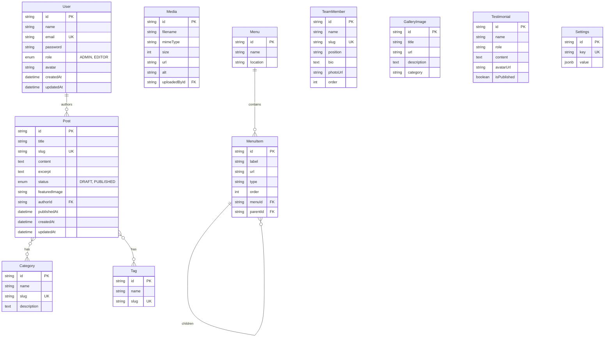

# 🗄️ Database Schema (Yayasan Alfida)

This document outlines the database schema for the SIM Alfida (NextCMS).
**Note on Multi-Schema Architecture:** All tables listed below are deployed in a dedicated PostgreSQL schema named `cms` within the shared Supabase project, rather than the default `public` schema. This isolates SIM Alfida data from other systems.

| Item | Detail |
|---|---|
| **Database** | PostgreSQL (Supabase) |
| **ORM** | Prisma |
| **ID Strategy** | CUID (collision-resistant unique identifier) |

---

## Daftar Isi
1. [Entity Relationship Diagram (ERD)](#1-entity-relationship-diagram-erd)
2. [Prisma Schema](#2-prisma-schema)

---

## 1. Entity Relationship Diagram (ERD)

```mermaid
erDiagram
    User {
        string id PK
        string name
        string email UK
        string password
        enum role "ADMIN, EDITOR"
        string avatar
        datetime createdAt
        datetime updatedAt
    }

    Post {
        string id PK
        string title
        string slug UK
        text content
        text excerpt
        enum status "DRAFT, PUBLISHED"
        string featuredImage
        string authorId FK
        datetime publishedAt
        datetime createdAt
        datetime updatedAt
    }

    Category {
        string id PK
        string name
        string slug UK
        text description
    }

    Tag {
        string id PK
        string name
        string slug UK
    }

    Media {
        string id PK
        string filename
        string mimeType
        int size
        string url
        string alt
        string uploadedById FK
    }

    Menu {
        string id PK
        string name
        string location
    }

    MenuItem {
        string id PK
        string label
        string url
        string type
        int order
        string menuId FK
        string parentId FK
    }

    TeamMember {
        string id PK
        string name
        string slug UK
        string position
        text bio
        string photoUrl
        int order
    }

    GalleryImage {
        string id PK
        string title
        string url
        text description
        string category
    }

    Testimonial {
        string id PK
        string name
        string role
        text content
        string avatarUrl
        boolean isPublished
    }

    Settings {
        string id PK
        string key UK
        jsonb value
    }

    Post }o--o{ Category : "has"
    Post }o--o{ Tag : "has"
    User ||--o{ Post : "authors"
    Menu ||--o{ MenuItem : "contains"
    MenuItem ||--o{ MenuItem : "children"
```

---

## 2. Prisma Schema

Akan disinkronisasi langsung di file `prisma/schema.prisma`. Skema inti akan mencakup:
- **`Post`**: Untuk Berita dan Artikel
- **`TeamMember`**: Entitas khusus guru & staff
- **`GalleryImage`**: Entitas galeri foto kegiatan
- **`Testimonial`**: Entitas untuk menyimpan testimoni
- **`Menu` & `MenuItem`**: Pengaturan navigasi
- **`Settings`**: Data konfigurasi global (kontak, tentang sekolah)
