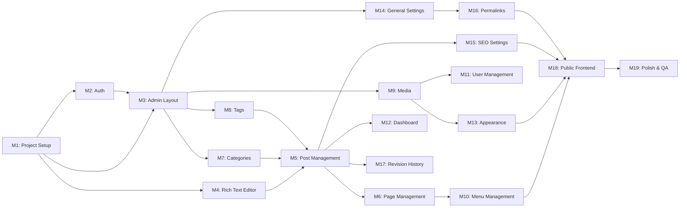
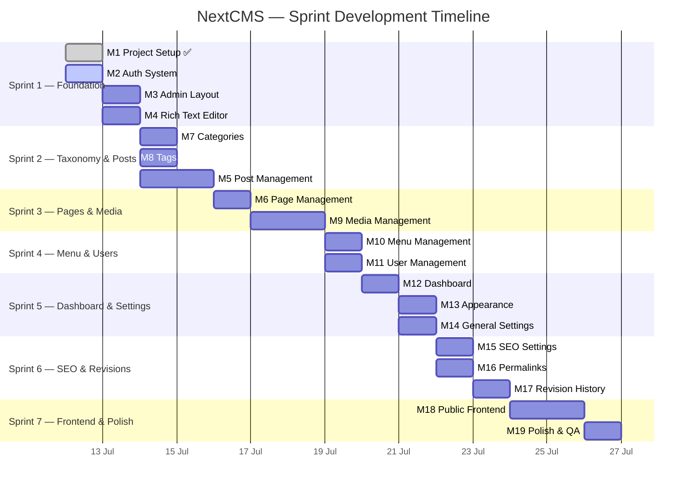

# 🗓️ Sprint Development Plan — NextCMS

> Rencana pengembangan per-sprint untuk seluruh fitur NextCMS, disusun berdasarkan [PRD.md](./PRD.md), [TDD.md](./TDD.md), dan [db-scheme.md](./db-scheme.md).

| Dokumen | Detail |
|---|---|
| **Referensi** | PRD.md, TDD.md, db-scheme.md |
| **Versi** | 1.0 |
| **Tanggal** | 12 Juli 2026 |
| **Total Estimasi** | ~115 jam (~14 hari kerja) |
| **Jumlah Sprint** | 7 Sprint |
| **Durasi per Sprint** | 2 hari kerja (~16 jam) |

---

## Dependency Graph

---

## Ringkasan Sprint

| Sprint | Hari | Modul | Fokus | Estimasi |
|---|---|---|---|---|
| **Sprint 1** | Hari 1–2 | M1 ✅, M2, M3, M4 | Foundation & Auth | 23 jam |
| **Sprint 2** | Hari 3–4 | M7, M8, M5 | Taxonomy & Post Management | 17 jam |
| **Sprint 3** | Hari 5–6 | M6, M9 | Page & Media Management | 16 jam |
| **Sprint 4** | Hari 7–8 | M10, M11 | Menu & User Management | 14 jam |
| **Sprint 5** | Hari 9–10 | M12, M13, M14 | Dashboard & Settings | 14 jam |
| **Sprint 6** | Hari 11–12 | M15, M16, M17 | SEO, Permalink & Revisions | 15 jam |
| **Sprint 7** | Hari 13–14 | M18, M19 | Public Frontend & Polish | 16 jam |

---

## Sprint 1 — Foundation & Auth (Hari 1–2)

> **Goal:** Proyek berjalan, auth bekerja, admin shell siap, editor siap pakai.

### M1: Project Setup & Foundation — ⏱️ 4 jam ✅ SELESAI

| # | Task | Detail | Estimasi | Status |
|---|---|---|---|---|
| 1.1 | Init Next.js | `create-next-app` + TypeScript + App Router + Tailwind | 15 min | ✅ |
| 1.2 | Setup shadcn/UI | `npx shadcn-ui@latest init` + komponen dasar | 30 min | ✅ |
| 1.3 | Design System | `npx designdotmd add starbucks` + theme config | 30 min | ✅ |
| 1.4 | Prisma Setup | Install, init schema, configure PostgreSQL | 30 min | ✅ |
| 1.5 | Schema Models | Definisi semua model, relasi, enum, index | 60 min | ✅ |
| 1.6 | Migration | `prisma migrate dev --name init` | 15 min | ✅ |
| 1.7 | Seed Script | Admin user, default settings, uncategorized category | 30 min | ✅ |
| 1.8 | Environment | `.env`, `.env.example`, `constants.ts` | 15 min | ✅ |
| 1.9 | Prisma Client | Singleton pattern di `src/lib/prisma.ts` | 15 min | ✅ |

**Deliverables:** ✅ Proyek berjalan, database terkoneksi, seed berhasil.

---

### M2: Auth (Login, Register, Middleware) — ⏱️ 6 jam

| # | Task | Detail | Estimasi | Status |
|---|---|---|---|---|
| 2.1 | Install Dependencies | `next-auth`, `zod`, `react-hook-form`, `@hookform/resolvers`, `@next-auth/prisma-adapter` | 15 min | ✅ |
| 2.2 | NextAuth Config | `src/lib/auth.ts` — CredentialsProvider, Google, GitHub, PrismaAdapter, JWT callbacks | 60 min | ✅ |
| 2.3 | Auth API Route | `src/app/api/auth/[...nextauth]/route.ts` — NextAuth handler | 15 min | ✅ |
| 2.4 | Type Extensions | Extend `next-auth` types untuk `id`, `role`, `avatar` di session/token | 15 min | ✅ |
| 2.5 | Auth Guard | `src/lib/auth-guard.ts` — `requireAuth()`, `requireRole()` helpers | 30 min | ✅ |
| 2.6 | Middleware | `src/middleware.ts` — route protection `/admin/*`, role-based redirect | 45 min | ✅ |
| 2.7 | Register API | `POST /api/register` — validasi Zod, cek duplikat email, bcrypt hash | 30 min | ✅ |
| 2.8 | Session Provider | `src/components/providers/session-provider.tsx` — client-side wrapper | 15 min | ✅ |
| 2.9 | Login Page | `src/app/(auth)/login/page.tsx` — form UI, validasi, error states, SSO buttons | 60 min | ✅ |
| 2.10 | Register Page | `src/app/(auth)/register/page.tsx` — form, password strength, SSO buttons | 60 min | ✅ |
| 2.11 | Testing | Login/logout flow, SSO flow, redirect, protected routes, register flow | 30 min | ✅ |

**Deliverables:** ✅ User bisa login/register dengan credentials atau SSO (Google/GitHub), route admin terproteksi.

**Dependencies:** M1

**File yang dibuat/diubah:**
- `src/lib/auth.ts`
- `src/lib/auth-guard.ts`
- `src/middleware.ts`
- `src/types/index.ts` (atau `src/types/next-auth.d.ts`)
- `src/app/api/auth/[...nextauth]/route.ts`
- `src/app/api/register/route.ts`
- `src/app/(auth)/layout.tsx`
- `src/app/(auth)/login/page.tsx`
- `src/app/(auth)/register/page.tsx`
- `src/components/auth/login-form.tsx`
- `src/components/auth/register-form.tsx`
- `src/components/providers/session-provider.tsx`

**Acceptance Criteria:**
- [ ] Login dengan `admin@nextcms.local` / `admin123` berhasil redirect ke `/admin`
- [ ] Akses `/admin` tanpa login redirect ke `/login`
- [ ] Register user baru berhasil, default role `SUBSCRIBER`
- [ ] Duplikat email ditolak dengan error message
- [ ] Password minimal 6 karakter dengan strength indicator
- [ ] Session persist setelah refresh browser

---

### M3: Admin Layout (Sidebar, Header) — ⏱️ 5 jam

| # | Task | Detail | Estimasi | Status |
|---|---|---|---|---|
| 3.1 | Install MUI Icons | `@mui/icons-material`, `@mui/material`, `@emotion/react`, `@emotion/styled` | 15 min | ⬜ |
| 3.2 | Install shadcn components | `button`, `card`, `dropdown-menu`, `sheet`, `separator`, `avatar`, `breadcrumb`, `skeleton`, `collapsible`, `tooltip`, `scroll-area`, `badge` | 15 min | ⬜ |
| 3.3 | Admin Layout | `src/app/admin/layout.tsx` — wrapper dengan sidebar + header + content area | 30 min | ⬜ |
| 3.4 | Sidebar | Collapsible sidebar, menu items dengan MUI icons, active state, sub-menus | 90 min | ⬜ |
| 3.5 | Header | Breadcrumb, search trigger, notification bell, user dropdown, "Visit Site" | 60 min | ⬜ |
| 3.6 | Mobile Responsive | Sheet sidebar untuk mobile, hamburger toggle, responsive breakpoints | 45 min | ⬜ |
| 3.7 | Theme/Query Provider | `src/components/providers/query-provider.tsx`, optional theme toggle | 30 min | ⬜ |
| 3.8 | Loading States | `admin/loading.tsx` — skeleton loaders untuk content area | 15 min | ⬜ |

**Deliverables:** Admin shell yang fully functional, navigasi bekerja di semua ukuran layar.

**Dependencies:** M1, M2

**File yang dibuat/diubah:**
- `src/app/admin/layout.tsx`
- `src/app/admin/loading.tsx`
- `src/components/admin/sidebar.tsx`
- `src/components/admin/header.tsx`
- `src/components/providers/query-provider.tsx`
- `src/app/layout.tsx` (update root layout)

**Acceptance Criteria:**
- [ ] Sidebar menampilkan semua menu sesuai PRD Section 7
- [ ] Sub-menu collapsible (Posts, Pages, Users, Settings)
- [ ] Active state highlight pada menu aktif
- [ ] Sidebar collapse di mobile menjadi Sheet
- [ ] User dropdown menampilkan nama, role, avatar, logout
- [ ] Breadcrumb dinamis berdasarkan route
- [ ] Semua icon menggunakan `@mui/icons-material`

---

### M4: Rich Text Editor (Tiptap) — ⏱️ 8 jam

| # | Task | Detail | Estimasi | Status |
|---|---|---|---|---|
| 4.1 | Install Tiptap | `@tiptap/react`, `@tiptap/starter-kit`, semua extensions sesuai TDD §1.5 | 15 min | ⬜ |
| 4.2 | Editor Instance | `src/components/editor/rich-text-editor.tsx` — configure Tiptap instance | 60 min | ⬜ |
| 4.3 | Toolbar | Fixed toolbar — Bold, Italic, Underline, Strikethrough, Headings (H1-H3), Align, Lists, Blockquote, Code, Link, Image, Table, Undo/Redo | 90 min | ⬜ |
| 4.4 | Bubble Menu | Selection-based floating menu (Bold, Italic, Link) | 45 min | ⬜ |
| 4.5 | Image Extension | Custom extension — trigger media picker dialog, insert image node | 60 min | ⬜ |
| 4.6 | Table Extension | Insert/edit table, tambah/hapus rows/columns | 30 min | ⬜ |
| 4.7 | Code Block | Syntax highlighting via `lowlight` | 30 min | ⬜ |
| 4.8 | YouTube Embed | Embed YouTube video via URL paste/dialog | 15 min | ⬜ |
| 4.9 | Editor Styling | Typography, spacing, list styles, image sizing, responsive | 45 min | ⬜ |
| 4.10 | Output Sanitize | DOMPurify config untuk safe HTML render di public pages | 15 min | ⬜ |
| 4.11 | Testing | Semua formatting features, paste handling, edge cases | 30 min | ⬜ |

**Deliverables:** Komponen Rich Text Editor siap digunakan di Post & Page editor.

**Dependencies:** M1

**File yang dibuat/diubah:**
- `src/components/editor/rich-text-editor.tsx`
- `src/components/editor/toolbar.tsx`
- `src/components/editor/bubble-menu.tsx`
- `src/components/editor/extensions/image-upload.ts`
- `src/lib/sanitize.ts`

**Acceptance Criteria:**
- [ ] Semua format text berfungsi (bold, italic, underline, strikethrough)
- [ ] Heading H1-H3 via dropdown
- [ ] Ordered dan unordered list
- [ ] Blockquote dan code block dengan syntax highlighting
- [ ] Insert/edit link
- [ ] Insert image (placeholder — integrasi media picker di Sprint 3)
- [ ] Insert table, tambah/hapus row/column
- [ ] YouTube embed
- [ ] Text alignment (left, center, right)
- [ ] Undo/Redo
- [ ] Output HTML di-sanitize dengan DOMPurify

---

## Sprint 2 — Taxonomy & Post Management (Hari 3–4)

> **Goal:** Kategori dan tag bisa dikelola, post CRUD lengkap dengan editor.

### M7: Category Management — ⏱️ 4 jam

| # | Task | Detail | Estimasi | Status |
|---|---|---|---|---|
| 7.1 | Zod Validators | `src/lib/validators/category.ts` — create/update schema | 15 min | ⬜ |
| 7.2 | Server Actions | `src/actions/category.ts` — CRUD (getCategories, create, update, delete) dengan hierarchy | 45 min | ⬜ |
| 7.3 | Category Page UI | `src/app/admin/categories/page.tsx` — 2-column: form (kiri) + table (kanan) | 90 min | ⬜ |
| 7.4 | Hierarchy | Parent category dropdown, indented display dengan "—" prefix | 30 min | ⬜ |
| 7.5 | Post Count | Aggregate `_count` posts per category | 15 min | ⬜ |
| 7.6 | Inline Edit | Edit nama, slug, description langsung di tabel | 30 min | ⬜ |
| 7.7 | Validation | Unique slug check, prevent self-referential parent | 15 min | ⬜ |

**Deliverables:** Full category management dengan hierarchy.

**Dependencies:** M1, M2, M3

**File yang dibuat/diubah:**
- `src/lib/validators/category.ts`
- `src/actions/category.ts`
- `src/app/admin/categories/page.tsx`

**Acceptance Criteria:**
- [ ] Buat kategori baru dengan name, slug (auto-generate), parent, description
- [ ] Slug auto-generate dari name, bisa diedit manual
- [ ] Parent category dropdown menampilkan hierarchy
- [ ] Tabel menampilkan kategori dengan indentasi hierarchy
- [ ] Post count ditampilkan per kategori
- [ ] Edit inline dan delete berfungsi
- [ ] Slug unik — duplikat ditolak

---

### M8: Tag Management — ⏱️ 3 jam

| # | Task | Detail | Estimasi | Status |
|---|---|---|---|---|
| 8.1 | Zod Validators | `src/lib/validators/tag.ts` — create/update schema | 10 min | ⬜ |
| 8.2 | Server Actions | `src/actions/tag.ts` — CRUD tags | 30 min | ⬜ |
| 8.3 | Tag Page UI | `src/app/admin/tags/page.tsx` — 2-column layout (tanpa hierarchy) | 60 min | ⬜ |
| 8.4 | Tag Input Component | `src/components/admin/tag-input.tsx` — autocomplete tag untuk post editor | 45 min | ⬜ |
| 8.5 | Post Count | Aggregate `_count` per tag | 15 min | ⬜ |
| 8.6 | Inline Edit | Edit nama, slug, description | 20 min | ⬜ |

**Deliverables:** Full tag management + reusable tag input component.

**Dependencies:** M1, M2, M3

**File yang dibuat/diubah:**
- `src/lib/validators/tag.ts`
- `src/actions/tag.ts`
- `src/app/admin/tags/page.tsx`
- `src/components/admin/tag-input.tsx`

**Acceptance Criteria:**
- [ ] Buat/edit/hapus tag
- [ ] Slug auto-generate, unique
- [ ] Tag input component dengan autocomplete search
- [ ] Post count per tag ditampilkan

---

### M5: Post Management (CRUD) — ⏱️ 10 jam

| # | Task | Detail | Estimasi | Status |
|---|---|---|---|---|
| 5.1 | Zod Validators | `src/lib/validators/post.ts` — CreatePostInput, UpdatePostInput | 30 min | ⬜ |
| 5.2 | Server Actions | `src/actions/post.ts` — getPosts, getPostById, create, update, delete, bulkAction | 120 min | ⬜ |
| 5.3 | Data Table | Install `@tanstack/react-table`, buat `src/components/admin/data-table.tsx` generic | 60 min | ⬜ |
| 5.4 | Post List Page | `src/app/admin/posts/page.tsx` — data table, filter status tabs, search, pagination, bulk actions | 120 min | ⬜ |
| 5.5 | Post Editor Page | `src/app/admin/posts/new/page.tsx` & `[id]/edit/page.tsx` — title, slug, editor, sidebar | 150 min | ⬜ |
| 5.6 | Slug Input | `src/components/admin/slug-input.tsx` — auto-generate dari title, editable, uniqueness check | 20 min | ⬜ |
| 5.7 | Auto-save | `src/hooks/use-auto-save.ts` — 60s interval untuk drafts | 30 min | ⬜ |
| 5.8 | Status Workflow | Draft → Pending → Published, Trash soft-delete | 20 min | ⬜ |
| 5.9 | Revalidation | `revalidatePath` pada setiap mutation | 10 min | ⬜ |

**Deliverables:** Full post CRUD dengan editor, filter, bulk actions.

**Dependencies:** M1, M2, M3, M4, M7, M8

**Sidebar Editor mencakup:**
- Publish Box (status, visibility, publish date, Save Draft / Publish button)
- Categories (checklist tree, "Add New Category")
- Tags (tag input component dari M8)
- Featured Image (placeholder — integrasi media picker Sprint 3)
- SEO Fields (meta title, description, OG image — placeholder)
- Excerpt textarea
- Revision History link (placeholder — integrasi Sprint 6)

**File yang dibuat/diubah:**
- `src/lib/validators/post.ts`
- `src/actions/post.ts`
- `src/components/admin/data-table.tsx`
- `src/components/admin/slug-input.tsx`
- `src/app/admin/posts/page.tsx`
- `src/app/admin/posts/new/page.tsx`
- `src/app/admin/posts/[id]/edit/page.tsx`
- `src/hooks/use-auto-save.ts`

**Acceptance Criteria:**
- [ ] Post list menampilkan title, author, categories, tags, status badge, date
- [ ] Filter tabs: All, Published, Draft, Pending, Trash — dengan count
- [ ] Search post by title
- [ ] Pagination berfungsi
- [ ] Bulk actions: Publish, Move to Trash, Delete Permanently
- [ ] Create post dengan title auto-slug, rich text editor, category checkboxes, tag input
- [ ] Edit post memuat data existing
- [ ] Auto-save draft setiap 60 detik
- [ ] Status workflow: Draft → Pending → Published
- [ ] Trash = soft delete, bisa restore

---

## Sprint 3 — Page & Media Management (Hari 5–6)

> **Goal:** Page management dan media library lengkap, media picker terintegrasi ke editor.

### M6: Page Management (CRUD) — ⏱️ 6 jam

| # | Task | Detail | Estimasi | Status |
|---|---|---|---|---|
| 6.1 | Zod Validators | `src/lib/validators/page.ts` | 15 min | ⬜ |
| 6.2 | Server Actions | `src/actions/page.ts` — CRUD pages (mirip post, tanpa categories/tags) | 60 min | ⬜ |
| 6.3 | Page List | `src/app/admin/pages/page.tsx` — data table, hierarchical indent | 60 min | ⬜ |
| 6.4 | Page Editor | `src/app/admin/pages/new/page.tsx` & `[id]/edit/page.tsx` — editor + sidebar | 90 min | ⬜ |
| 6.5 | Page Attributes | Sidebar: parent page dropdown (nested), template selection, menu order | 30 min | ⬜ |
| 6.6 | Quick Edit | Inline edit di list (title, slug, status) | 30 min | ⬜ |
| 6.7 | Hierarchy | Parent-child relationship display, nested dropdown | 30 min | ⬜ |
| 6.8 | Revalidation | `revalidatePath` | 10 min | ⬜ |

**Deliverables:** Full page CRUD dengan hierarchy dan template support.

**Dependencies:** M1, M2, M3, M4

**File yang dibuat/diubah:**
- `src/lib/validators/page.ts`
- `src/actions/page.ts`
- `src/app/admin/pages/page.tsx`
- `src/app/admin/pages/new/page.tsx`
- `src/app/admin/pages/[id]/edit/page.tsx`

**Acceptance Criteria:**
- [ ] Page list dengan hierarchical indent (child pages di-indent)
- [ ] Template selection: Default, Full Width, Sidebar
- [ ] Parent page dropdown (hierarchical)
- [ ] Menu order berfungsi
- [ ] Quick edit inline
- [ ] SEO fields berfungsi

---

### M9: Media Management — ⏱️ 10 jam

| # | Task | Detail | Estimasi | Status |
|---|---|---|---|---|
| 9.1 | Install Sharp | `sharp` untuk image processing & thumbnail | 15 min | ⬜ |
| 9.2 | Upload API Route | `POST /api/upload` — multipart handling, file save, DB record | 90 min | ⬜ |
| 9.3 | File Storage | `src/lib/upload.ts` — organize by year/month, unique filename, thumbnail generation | 60 min | ⬜ |
| 9.4 | Zod Validators | `src/lib/validators/media.ts` — MIME whitelist, max size validation | 15 min | ⬜ |
| 9.5 | Server Actions | `src/actions/media.ts` — getMedia, updateMedia metadata | 30 min | ⬜ |
| 9.6 | Media Library Page | `src/app/admin/media/page.tsx` — grid view + list view toggle | 90 min | ⬜ |
| 9.7 | Drag & Drop Upload | DnD upload zone + progress indicator | 60 min | ⬜ |
| 9.8 | Media Detail | Drawer/modal — preview, alt text, caption, file info, copy URL, delete | 60 min | ⬜ |
| 9.9 | Media Picker | `src/components/admin/media-picker.tsx` — reusable dialog: upload tab + library tab + search | 90 min | ⬜ |
| 9.10 | Editor Integration | Integrasikan media picker ke Tiptap image extension dan Featured Image | 30 min | ⬜ |
| 9.11 | Delete | `DELETE /api/upload/:id` — hapus file dari disk + DB record | 20 min | ⬜ |

**Deliverables:** Media library, upload system, reusable media picker terintegrasi ke editor.

**Dependencies:** M1, M2, M3

**File yang dibuat/diubah:**
- `src/lib/upload.ts`
- `src/lib/validators/media.ts`
- `src/actions/media.ts`
- `src/app/api/upload/route.ts`
- `src/app/admin/media/page.tsx`
- `src/components/admin/media-picker.tsx`
- `src/hooks/use-media-picker.ts`
- Update: `src/components/editor/extensions/image-upload.ts`

**Acceptance Criteria:**
- [ ] Upload file via drag & drop dan click
- [ ] Progress indicator saat upload
- [ ] Multi-file upload support
- [ ] File disimpan di `public/uploads/YYYY/MM/` dengan nama unik
- [ ] Thumbnail auto-generate untuk gambar
- [ ] MIME type whitelist (jpg, png, gif, webp, svg, mp4, webm, pdf)
- [ ] Max size 10MB
- [ ] Grid view (thumbnail grid) dan list view (table) toggle
- [ ] Media detail modal: preview, edit alt/caption, file info
- [ ] Copy URL button
- [ ] Delete file + record
- [ ] Media picker dialog berfungsi di post/page editor (featured image + inline image)

---

## Sprint 4 — Menu & User Management (Hari 7–8)

> **Goal:** Menu builder dengan drag & drop dan user management dengan RBAC.

### M10: Menu Management — ⏱️ 8 jam

| # | Task | Detail | Estimasi | Status |
|---|---|---|---|---|
| 10.1 | Install DnD Kit | `@dnd-kit/core`, `@dnd-kit/sortable` | 10 min | ⬜ |
| 10.2 | Zod Validators | `src/lib/validators/menu.ts` | 15 min | ⬜ |
| 10.3 | Server Actions | `src/actions/menu.ts` — CRUD menus + nested menu items | 60 min | ⬜ |
| 10.4 | Menu Page UI | `src/app/admin/menus/page.tsx` — select/create menu, assign location | 30 min | ⬜ |
| 10.5 | Item Sources Panel | Kiri: Pages, Posts, Categories checkbox lists + Custom Links form + "Add to Menu" | 60 min | ⬜ |
| 10.6 | Drag & Drop Tree | @dnd-kit sortable + nestable tree structure (sub-items) | 120 min | ⬜ |
| 10.7 | Item Edit | Inline edit label, URL, target (`_self` / `_blank`), CSS class | 30 min | ⬜ |
| 10.8 | Menu Item Types | Resolve reference: Page → slug, Post → slug, Category → slug | 30 min | ⬜ |
| 10.9 | Save & Serialize | Flatten tree → ordered items with `parentId` + `order` fields | 30 min | ⬜ |
| 10.10 | Preview | Visual preview of menu structure | 30 min | ⬜ |

**Deliverables:** Full menu builder dengan drag & drop reordering dan nesting.

**Dependencies:** M1, M2, M3, M5, M6, M7

**File yang dibuat/diubah:**
- `src/lib/validators/menu.ts`
- `src/actions/menu.ts`
- `src/app/admin/menus/page.tsx`

**Acceptance Criteria:**
- [ ] Buat/hapus menu
- [ ] Assign menu ke lokasi (Header, Footer, Sidebar)
- [ ] Tambah item dari: Pages, Posts, Categories, Custom Links
- [ ] Drag & drop reorder items
- [ ] Drag to nest (sub-menu)
- [ ] Edit label, URL, target per item
- [ ] Save menyimpan urutan dan hierarchy yang benar
- [ ] Delete item (cascade children optional)

---

### M11: User Management — ⏱️ 6 jam

| # | Task | Detail | Estimasi | Status |
|---|---|---|---|---|
| 11.1 | Zod Validators | `src/lib/validators/user.ts` — create/update schema | 15 min | ⬜ |
| 11.2 | Server Actions | `src/actions/user.ts` — CRUD, changePassword, role change | 60 min | ⬜ |
| 11.3 | User List Page | `src/app/admin/users/page.tsx` — data table, filter by role, search, bulk actions | 60 min | ⬜ |
| 11.4 | User Edit Page | `src/app/admin/users/[id]/edit/page.tsx` — profile form, avatar, password change | 90 min | ⬜ |
| 11.5 | Create User Page | `src/app/admin/users/new/page.tsx` — admin buat user baru | 30 min | ⬜ |
| 11.6 | Own Profile | Non-admin user bisa edit profil sendiri (name, email, bio, avatar, password) | 30 min | ⬜ |
| 11.7 | Role Guards | Middleware + server action checks: hanya ADMIN bisa akses `/admin/users` | 30 min | ⬜ |
| 11.8 | Avatar Integration | Avatar upload via media picker | 30 min | ⬜ |

**Deliverables:** Full user management dengan RBAC enforcement.

**Dependencies:** M1, M2, M3, M9

**File yang dibuat/diubah:**
- `src/lib/validators/user.ts`
- `src/actions/user.ts`
- `src/app/admin/users/page.tsx`
- `src/app/admin/users/new/page.tsx`
- `src/app/admin/users/[id]/edit/page.tsx`

**Acceptance Criteria:**
- [ ] User list: avatar, name, email, role badge, posts count, date
- [ ] Filter by role tabs
- [ ] Search by name/email
- [ ] Bulk action: Change Role
- [ ] Create user (admin only) — name, email, password, role
- [ ] Edit user — name, email, role, bio, avatar
- [ ] Change password (optional field)
- [ ] Non-admin hanya bisa edit profil sendiri
- [ ] Delete user (admin only, tidak bisa self-delete)

---

## Sprint 5 — Dashboard & Settings (Hari 9–10)

> **Goal:** Dashboard informatif, pengaturan umum situs dan tampilan.

### M12: Dashboard — ⏱️ 6 jam

| # | Task | Detail | Estimasi | Status |
|---|---|---|---|---|
| 12.1 | Install Recharts | `recharts` untuk bar chart | 10 min | ⬜ |
| 12.2 | Dashboard Actions | `src/actions/dashboard.ts` — aggregate queries (counts, recent, chart data) | 60 min | ⬜ |
| 12.3 | Stats Cards | `src/components/admin/dashboard/stats-cards.tsx` — Posts, Pages, Media, Users counts | 45 min | ⬜ |
| 12.4 | Recent Posts | `src/components/admin/dashboard/recent-posts.tsx` — 5 terbaru + status badge | 30 min | ⬜ |
| 12.5 | Quick Draft | `src/components/admin/dashboard/quick-draft.tsx` — mini form → create draft | 30 min | ⬜ |
| 12.6 | Content Chart | `src/components/admin/dashboard/content-chart.tsx` — Recharts bar chart: posts/bulan | 60 min | ⬜ |
| 12.7 | Draft Posts | List draft posts milik user | 20 min | ⬜ |
| 12.8 | Activity Log | `src/components/admin/dashboard/activity-log.tsx` — recent create/update/delete | 45 min | ⬜ |
| 12.9 | Dashboard Page | `src/app/admin/page.tsx` — layout grid responsive, loading skeletons | 30 min | ⬜ |

**Deliverables:** Dashboard WordPress-style dengan 6+ widgets.

**Dependencies:** M1, M2, M3, M5

**File yang dibuat/diubah:**
- `src/actions/dashboard.ts`
- `src/app/admin/page.tsx`
- `src/components/admin/dashboard/stats-cards.tsx`
- `src/components/admin/dashboard/recent-posts.tsx`
- `src/components/admin/dashboard/quick-draft.tsx`
- `src/components/admin/dashboard/content-chart.tsx`
- `src/components/admin/dashboard/activity-log.tsx`

**Acceptance Criteria:**
- [ ] 4 stats cards: Posts, Pages, Media, Users — masing-masing dengan MUI icon dan warna
- [ ] Recent posts table (5 rows): title, status badge, author, date
- [ ] Quick draft form: title + content → save creates draft post
- [ ] Bar chart: posts per bulan (6 bulan terakhir)
- [ ] Activity log: timeline list events terbaru
- [ ] Responsive grid layout (2 kolom desktop, 1 kolom mobile)
- [ ] Loading skeleton saat data fetching

---

### M13: Appearance Settings — ⏱️ 5 jam

| # | Task | Detail | Estimasi | Status |
|---|---|---|---|---|
| 13.1 | Server Actions | `src/actions/appearance.ts` — get/update appearance (JSON values) | 30 min | ⬜ |
| 13.2 | Settings Form | `src/app/admin/appearance/page.tsx` — logo, favicon (media picker), colors, font, header style | 90 min | ⬜ |
| 13.3 | Custom CSS/Script | Textarea/code-editor fields untuk custom CSS, header script, footer script | 30 min | ⬜ |
| 13.4 | Color Picker | Komponen color picker (Popover + hex input) | 45 min | ⬜ |
| 13.5 | Live Preview | Preview warna/font sebelum save (optional) | 30 min | ⬜ |
| 13.6 | Apply Theme | Load appearance settings di public layout sebagai CSS variables | 45 min | ⬜ |

**Deliverables:** Full appearance customization — logo, warna, font, custom CSS.

**Dependencies:** M1, M2, M3, M9

**File yang dibuat/diubah:**
- `src/actions/appearance.ts`
- `src/app/admin/appearance/page.tsx`

**Acceptance Criteria:**
- [ ] Upload logo dan favicon via media picker
- [ ] Color picker untuk primary dan secondary color
- [ ] Font family dropdown
- [ ] Header style radio (Centered, Left-aligned, Minimal)
- [ ] Sidebar position radio (Left, Right, None)
- [ ] Footer text textarea
- [ ] Custom CSS, Custom Header Script, Custom Footer Script textareas
- [ ] Save berhasil, settings tersimpan di tabel `appearance`
- [ ] Public layout membaca dan menerapkan CSS variables dari settings

---

### M14: General Settings — ⏱️ 3 jam

| # | Task | Detail | Estimasi | Status |
|---|---|---|---|---|
| 14.1 | Zod Validators | `src/lib/validators/settings.ts` | 10 min | ⬜ |
| 14.2 | Server Actions | `src/actions/settings.ts` — load/save ke `SiteSettings` (key-value) | 30 min | ⬜ |
| 14.3 | Settings Form | `src/app/admin/settings/general/page.tsx` — site title, tagline, URL, admin email, language, timezone, date/time format, posts per page, registration toggle, default role | 60 min | ⬜ |
| 14.4 | Content Settings | Posts per page (number), registration open (switch), default role (dropdown) | 30 min | ⬜ |
| 14.5 | Validation | Zod: validate URL format, email format | 20 min | ⬜ |
| 14.6 | Apply Settings | Load settings di public pages: `<title>`, meta tags | 20 min | ⬜ |

**Deliverables:** General settings page fully functional.

**Dependencies:** M1, M2, M3

**File yang dibuat/diubah:**
- `src/lib/validators/settings.ts`
- `src/actions/settings.ts`
- `src/app/admin/settings/general/page.tsx`
- `src/app/admin/settings/layout.tsx` (optional settings layout)

**Acceptance Criteria:**
- [ ] Form menampilkan semua field sesuai PRD §6.13
- [ ] Load existing settings dari database
- [ ] Save changes berhasil update database
- [ ] Validasi: URL format, email format
- [ ] Toggle registration open/close
- [ ] Default role dropdown (SUBSCRIBER, AUTHOR, EDITOR)

---

## Sprint 6 — SEO, Permalink & Revisions (Hari 11–12)

> **Goal:** SEO lengkap, permalink konfigurabel, sistem revisi berfungsi.

### M15: SEO Settings — ⏱️ 4 jam

| # | Task | Detail | Estimasi | Status |
|---|---|---|---|---|
| 15.1 | Global SEO Page | `src/app/admin/settings/seo/page.tsx` — meta title template, default description, OG image, robots.txt | 60 min | ⬜ |
| 15.2 | Social Profiles | Facebook, Twitter, Instagram URL inputs | 15 min | ⬜ |
| 15.3 | Analytics | Google Analytics ID input, inject script | 15 min | ⬜ |
| 15.4 | Sitemap | `src/app/sitemap.ts` — auto-generate `sitemap.xml` dari published posts/pages | 60 min | ⬜ |
| 15.5 | SEO Fields Component | `src/components/admin/seo-fields.tsx` — reusable: meta title, description, OG image picker, Google preview snippet | 45 min | ⬜ |
| 15.6 | Head Rendering | Dynamic `<head>` di public pages — meta, og:, twitter card tags | 45 min | ⬜ |

**Deliverables:** SEO global + per-content, sitemap auto-generation.

**Dependencies:** M1, M2, M3, M5, M6

**File yang dibuat/diubah:**
- `src/app/admin/settings/seo/page.tsx`
- `src/components/admin/seo-fields.tsx`
- `src/app/sitemap.ts`
- Update: post/page editor untuk integrate SEO fields

**Acceptance Criteria:**
- [ ] Global SEO settings: meta title template (`%title% - %sitename%`), description, OG image
- [ ] Social profile URLs
- [ ] Google Analytics ID injection
- [ ] `sitemap.xml` auto-generated dari published posts + pages
- [ ] Reusable SEO fields component di post/page editor sidebar
- [ ] Google search preview snippet di SEO fields
- [ ] Public pages render meta tags (title, description, og:image, twitter:card)

---

### M16: Permalink Settings — ⏱️ 3 jam

| # | Task | Detail | Estimasi | Status |
|---|---|---|---|---|
| 16.1 | Settings Page | `src/app/admin/settings/permalinks/page.tsx` — radio options untuk permalink structure | 45 min | ⬜ |
| 16.2 | Custom Pattern | Input field untuk custom permalink pattern | 20 min | ⬜ |
| 16.3 | Base Settings | Category base (`category`), Tag base (`tag`) inputs | 15 min | ⬜ |
| 16.4 | URL Resolution | `src/lib/permalink.ts` — generate URL dari pattern + post data | 45 min | ⬜ |
| 16.5 | Routing Integration | Dynamic route handling berdasarkan permalink setting | 30 min | ⬜ |
| 16.6 | Migration Warning | Warning dialog jika mengubah struktur yang sudah ada | 15 min | ⬜ |

**Deliverables:** Configurable permalink structures.

**Dependencies:** M1, M2, M3, M14

**File yang dibuat/diubah:**
- `src/app/admin/settings/permalinks/page.tsx`
- `src/lib/permalink.ts`

**Acceptance Criteria:**
- [ ] Radio options: Plain, Post Name, Day and Name, Month and Name, Custom
- [ ] Custom pattern input berfungsi
- [ ] Category base dan tag base configurable
- [ ] URL resolution menghasilkan permalink yang benar
- [ ] Warning dialog saat mengubah struktur

---

### M17: Revision History — ⏱️ 8 jam

| # | Task | Detail | Estimasi | Status |
|---|---|---|---|---|
| 17.1 | Install Diff | `diff` library untuk text comparison | 10 min | ⬜ |
| 17.2 | Revision Creation | Auto-create revision pada post/page update (snapshot current state sebelum overwrite) | 45 min | ⬜ |
| 17.3 | Server Actions | `src/actions/revision.ts` — getRevisions, getRevisionById, restoreRevision | 30 min | ⬜ |
| 17.4 | Revision List | `src/app/admin/revisions/[entityType]/[entityId]/page.tsx` — timeline UI | 60 min | ⬜ |
| 17.5 | Diff Engine | Side-by-side diff comparison (title + content) menggunakan `diff` library | 120 min | ⬜ |
| 17.6 | Diff UI | Highlighted diffs — green (added), red (removed), inline styling | 60 min | ⬜ |
| 17.7 | Restore | "Restore this revision" → overwrite current entity, create new revision entry | 45 min | ⬜ |
| 17.8 | Cleanup | Auto-delete oldest revisions ketika count > 25 per entity | 20 min | ⬜ |
| 17.9 | Editor Integration | "Revision History" link di post/page editor sidebar, menampilkan jumlah revisi | 15 min | ⬜ |
| 17.10 | Metadata Diff | Show changes in categories, tags, status, template (JSON diff) | 30 min | ⬜ |

**Deliverables:** Full revision system — view, compare, restore.

**Dependencies:** M1, M2, M3, M5, M6

**File yang dibuat/diubah:**
- `src/actions/revision.ts`
- `src/app/admin/revisions/[entityType]/[entityId]/page.tsx`
- Update: `src/actions/post.ts` dan `src/actions/page.ts` (auto-create revision on update)

**Acceptance Criteria:**
- [ ] Setiap update post/page otomatis membuat revision entry
- [ ] Revision list menampilkan timeline: date, author avatar+name, revision number
- [ ] Klik revision menampilkan diff comparison
- [ ] Diff: title dan content side-by-side, green=added, red=removed
- [ ] Metadata diff: perubahan status, categories, tags
- [ ] "Restore this revision" button memulihkan konten
- [ ] Maks 25 revisi per entity — oldest auto-deleted
- [ ] Link dari post/page editor sidebar menunjukkan jumlah revisi

---

## Sprint 7 — Public Frontend & Polish (Hari 13–14)

> **Goal:** Website publik berfungsi, production-ready polish.

### M18: Public Frontend — ⏱️ 10 jam

| # | Task | Detail | Estimasi | Status |
|---|---|---|---|---|
| 18.1 | Public Layout | `src/app/(public)/layout.tsx` — header (dynamic menu), footer (site info), responsive | 60 min | ⬜ |
| 18.2 | Site Header | `src/components/public/site-header.tsx` — logo, navigation dari Menu management, mobile hamburger | 30 min | ⬜ |
| 18.3 | Site Footer | `src/components/public/site-footer.tsx` — footer text, social links, copyright | 15 min | ⬜ |
| 18.4 | Homepage | `src/app/(public)/page.tsx` — hero section, latest posts grid, sidebar widgets | 60 min | ⬜ |
| 18.5 | Blog Listing | `src/app/(public)/blog/page.tsx` — post cards grid, pagination, filters | 60 min | ⬜ |
| 18.6 | Single Post | `src/app/(public)/blog/[slug]/page.tsx` — full post, author info, categories, tags, related posts | 60 min | ⬜ |
| 18.7 | Static Page | `src/app/(public)/[slug]/page.tsx` — page render, template support | 30 min | ⬜ |
| 18.8 | Category Archive | `src/app/(public)/category/[slug]/page.tsx` — posts by category, description | 30 min | ⬜ |
| 18.9 | Tag Archive | `src/app/(public)/tag/[slug]/page.tsx` — posts by tag | 20 min | ⬜ |
| 18.10 | SEO Rendering | Dynamic meta tags, OG tags, structured data per page | 45 min | ⬜ |
| 18.11 | Dynamic Menu | Resolve menu items, render nested navigation | 30 min | ⬜ |
| 18.12 | Appearance Apply | Load theme settings (colors → CSS vars, fonts, custom CSS) | 30 min | ⬜ |
| 18.13 | Post Card | `src/components/public/post-card.tsx` — thumbnail, title, excerpt, author, date | 20 min | ⬜ |
| 18.14 | Sidebar Widgets | `src/components/public/sidebar-widgets.tsx` — categories, recent posts, tags cloud | 20 min | ⬜ |
| 18.15 | Responsive | Mobile-first responsive design audit | 60 min | ⬜ |
| 18.16 | 404 Page | `src/app/not-found.tsx` — custom not-found page | 15 min | ⬜ |

**Deliverables:** Fully functional public-facing website.

**Dependencies:** M1, M5, M6, M7, M8, M10, M13, M14, M15, M16

**File yang dibuat/diubah:**
- `src/app/(public)/layout.tsx`
- `src/app/(public)/page.tsx`
- `src/app/(public)/blog/page.tsx`
- `src/app/(public)/blog/[slug]/page.tsx`
- `src/app/(public)/category/[slug]/page.tsx`
- `src/app/(public)/tag/[slug]/page.tsx`
- `src/app/(public)/[slug]/page.tsx`
- `src/components/public/site-header.tsx`
- `src/components/public/site-footer.tsx`
- `src/components/public/post-card.tsx`
- `src/components/public/pagination.tsx`
- `src/components/public/sidebar-widgets.tsx`
- `src/app/not-found.tsx`

**Acceptance Criteria:**
- [ ] Homepage menampilkan hero + latest posts
- [ ] Blog listing dengan post cards dan pagination
- [ ] Single post: full content, author, date, categories, tags, related posts
- [ ] Static page render sesuai template (Default, Full Width, Sidebar)
- [ ] Category/tag archive menampilkan filtered posts
- [ ] Header navigation dynamic dari menu management
- [ ] Footer menampilkan info dari settings
- [ ] SEO meta tags di setiap halaman (title, description, og:image)
- [ ] Appearance settings applied (colors, fonts, custom CSS)
- [ ] Responsive: mobile, tablet, desktop
- [ ] Custom 404 page

---

### M19: Polish & QA — ⏱️ 6 jam

| # | Task | Detail | Estimasi | Status |
|---|---|---|---|---|
| 19.1 | Install Sonner | `sonner` untuk toast notifications | 10 min | ⬜ |
| 19.2 | Error Handling | Global error boundaries, action error states, form error display | 45 min | ⬜ |
| 19.3 | Loading States | Skeleton loaders, Suspense boundaries, `loading.tsx` per route group | 45 min | ⬜ |
| 19.4 | Toast Notifications | Success/error toasts pada semua mutasi (create, update, delete) | 30 min | ⬜ |
| 19.5 | Responsive Audit | Test semua halaman di mobile (375px), tablet (768px), desktop (1280px+) | 60 min | ⬜ |
| 19.6 | Accessibility | Keyboard navigation, focus management, ARIA labels, screen reader labels | 45 min | ⬜ |
| 19.7 | Performance | Image optimization via `next/image`, lazy loading, bundle analysis | 30 min | ⬜ |
| 19.8 | Edge Cases | Empty states, long text truncation, special characters, concurrent edits warning | 45 min | ⬜ |

**Deliverables:** Production-ready polish — no broken states, smooth UX.

**Dependencies:** M1–M18 (semua modul)

**File yang dibuat/diubah:**
- `src/app/error.tsx` (global error boundary)
- `src/app/admin/error.tsx`
- Various `loading.tsx` files
- Various component updates for toasts, error states, empty states

**Acceptance Criteria:**
- [ ] Semua mutasi menampilkan toast (success/error)
- [ ] Error boundary menangkap crash tanpa blank page
- [ ] Loading skeleton di semua halaman admin
- [ ] Semua halaman responsive tanpa horizontal scroll
- [ ] Keyboard navigable (Tab, Enter, Escape)
- [ ] Empty states: "No posts yet", "No media found", dll
- [ ] Long text truncated dengan ellipsis
- [ ] `next/image` digunakan untuk semua gambar
- [ ] Tidak ada console errors di production build

---

## Checklist Dependencies Instalasi Per Sprint

| Sprint | Packages to Install |
|---|---|
| **Sprint 1** | `next-auth`, `zod`, `react-hook-form`, `@hookform/resolvers`, `@mui/icons-material`, `@mui/material`, `@emotion/react`, `@emotion/styled`, `@tiptap/react`, `@tiptap/starter-kit`, + semua tiptap extensions, `lowlight`, `dompurify`, `@types/dompurify`, `@tanstack/react-query`, shadcn components (button, input, label, form, card, checkbox, dialog, sheet, separator, avatar, breadcrumb, skeleton, collapsible, tooltip, scroll-area, badge, dropdown-menu, tabs, popover, alert-dialog, command, calendar, switch, progress) |
| **Sprint 2** | `@tanstack/react-table`, `slugify`, `date-fns` |
| **Sprint 3** | `sharp` |
| **Sprint 4** | `@dnd-kit/core`, `@dnd-kit/sortable` |
| **Sprint 5** | `recharts` |
| **Sprint 6** | `diff`, `@types/diff` |
| **Sprint 7** | `sonner` |

---

## Gantt Chart

---

## Catatan Penting

> [!IMPORTANT]
> - **M1 (Project Setup) sudah SELESAI**. Database, Prisma schema, seed data sudah berjalan.
> - Setiap modul harus di-test sebelum melanjutkan ke modul berikutnya.
> - Semua icon **WAJIB** menggunakan `@mui/icons-material`, bukan emoji.
> - Design mengacu pada Starbucks Design System (primary: `#00704A`, secondary: `#1E3932`).
> - Font: Inter (via Google Fonts).

> [!WARNING]
> - Modul M5 (Post Management) adalah modul paling kritis dan kompleks — alokasikan waktu ekstra jika diperlukan.
> - Drag & drop di M10 (Menu) memerlukan perhatian khusus untuk nesting behavior.
> - Diff engine di M17 (Revisions) bisa kompleks untuk HTML content — prioritaskan text diff dulu.

---

*Dokumen ini menjadi panduan utama development NextCMS. Update status (⬜ → ✅) seiring progress implementasi.*
