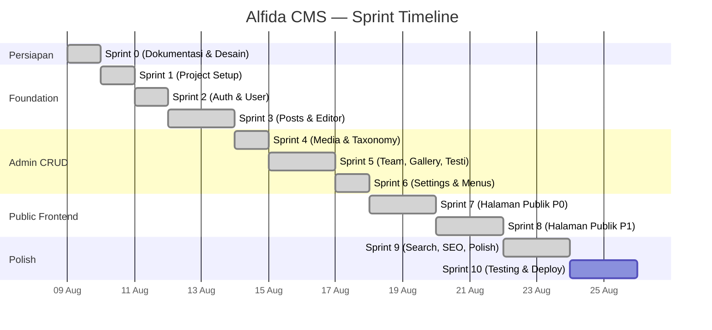

# Sprint Plan

## Alfida Content Management System

| Field | Value |
| --- | --- |
| **Produk** | Alfida CMS |
| **Versi** | Alpha |
| **Tanggal** | 9 Agustus 2026 |
| **Durasi Sprint** | ~1–2 hari per sprint |
| **Referensi** | [PRD.md](./PRD.md) · [TDD.md](./TDD.md) · [db-schema.md](./db-schema.md) |

---

## Ringkasan Status

```mermaid
gantt
    title Alfida CMS — Sprint Timeline
    dateFormat YYYY-MM-DD
    axisFormat %d %b

    section Persiapan
    Sprint 0 (Dokumentasi & Desain)  :done, s0, 2026-08-09, 1d

    section Foundation
    Sprint 1 (Project Setup)         :done, s1, after s0, 1d
    Sprint 2 (Auth & User)           :done, s2, after s1, 1d
    Sprint 3 (Posts & Editor)        :done, s3, after s2, 2d

    section Admin CRUD
    Sprint 4 (Media & Taxonomy)      :done, s4, after s3, 1d
    Sprint 5 (Team, Gallery, Testi)  :done, s5, after s4, 2d
    Sprint 6 (Settings & Menus)      :done, s6, after s5, 1d

    section Public Frontend
    Sprint 7 (Halaman Publik P0)     :done, s7, after s6, 2d
    Sprint 8 (Halaman Publik P1)     :done, s8, after s7, 2d

    section Polish
    Sprint 9 (Search, SEO, Polish)   :done, s9, after s8, 2d
    Sprint 10 (Testing & Deploy)     :s10, after s9, 2d
```

---

## Sprint 0 — Dokumentasi & Desain ✅

**Tanggal**: 9 Agustus 2026

| # | Task | Status |
| --- | --- | --- |
| 1 | Menyusun PRD.md (kebutuhan fungsional, prioritas) | ✅ |
| 2 | Menyusun TDD.md (arsitektur, routing, data layer) | ✅ |
| 3 | Menyusun db-schema.md (17 tabel, ER diagram) | ✅ |
| 4 | Sinkronisasi warna mockup HTML dengan DESIGN.md | ✅ |
| 5 | Membuat index.html navigasi di folder mockup | ✅ |
| 6 | Menyusun sprint-plan.md | ✅ |

---

## Sprint 1 — Project Setup ✅

> **Fokus**: Inisialisasi project, konfigurasi tools, dan koneksi services.

| # | Task | PRD ID | Deliverable | Status |
| --- | --- | --- | --- | --- |
| 1 | Init Next.js 15 (App Router, Turbopack) | — | `pnpm create next-app` dengan TypeScript, Tailwind CSS v4, ESLint | ✅ |
| 2 | Konfigurasi Prisma multi-schema | — | `schema.prisma` dengan `multiSchema` preview feature, koneksi Supabase (Transaction Pooler + Direct) | ✅ |
| 3 | Setup Supabase Auth SSR | AUTH-01 | `@supabase/ssr`, server client, browser client, middleware session refresh | ✅ |
| 4 | Setup Cloudinary SDK | MEDIA-04 | `src/lib/cloudinary.ts`, konfigurasi env vars | ✅ |
| 5 | Konfigurasi Tailwind CSS v4 + design tokens | — | `globals.css` dengan CSS custom properties sesuai DESIGN.md | ✅ |
| 6 | Path alias `@/*` + `tsconfig.json` strict mode | QA-01 | TypeScript strict, path alias | ✅ |
| 7 | Buat `.env.example` | — | Template semua env vars | ✅ |
| 8 | Prisma migrate — buat semua tabel | — | Migrasi schema `cms` + `shared` (17 tabel) | ✅ |

**Acceptance Criteria**: ✅ Semua terpenuhi
- `pnpm dev` berjalan tanpa error ✅
- Prisma terhubung ke Supabase, semua tabel ter-create ✅
- Supabase Auth bisa create session ✅
- Cloudinary bisa upload test image ✅
- `pnpm build` sukses ✅

---

## Sprint 2 — Auth & User Management ✅

> **Fokus**: Login, RBAC, dan user management di dashboard.

| # | Task | PRD ID | Deliverable | Status |
| --- | --- | --- | --- | --- |
| 1 | Halaman Login | AUTH-01 | `(auth)/login/page.tsx`, form email + password, sesuai wireframe `login.html` | ✅ |
| 2 | Middleware auth guard | AUTH-04 | Redirect ke `/login` jika belum auth untuk route `/admin/*` | ✅ |
| 3 | Relasi `SharedUser` ↔ `CmsUser` | AUTH-02 | Auto-create `CmsUser` saat user pertama kali login | ✅ |
| 4 | Admin layout + Sidebar | — | `admin/layout.tsx` dengan sidebar navigasi sesuai wireframe `dashboard.html` | ✅ |
| 5 | Dashboard Overview | DASH-01 | `admin/page.tsx` — statistik: jumlah post, team, galeri | ✅ |
| 6 | Users CRUD | AUTH-03 | List users, create user, edit role (SUPER_ADMIN / ADMIN / CONTRIBUTOR) | ✅ |
| 7 | Profile page | — | `admin/profile/page.tsx` — profil user yang login | ✅ |
| 8 | Server-side auth + role check helper | AUTH-04, AUTH-05 | Utility function untuk validasi auth + role di setiap Server Action | ✅ |

**Acceptance Criteria**: ✅ Semua terpenuhi
- Login berfungsi via Supabase Auth ✅
- Dashboard hanya bisa diakses oleh user yang sudah login ✅
- RBAC berfungsi — Contributor tidak bisa akses user management ✅
- Sidebar navigasi sesuai wireframe ✅
- `pnpm build` sukses ✅

---

## Sprint 3 — Posts & Editor ✅

> **Fokus**: CRUD Post dengan TipTap rich text editor.

| # | Task | PRD ID | Deliverable | Status |
| --- | --- | --- | --- | --- |
| 1 | Post list page | DASH-02 | `admin/posts/page.tsx` — daftar post, filter status, sesuai wireframe `post-list.html` | ✅ |
| 2 | Post editor — TipTap | EDIT-01 | `admin/posts/new/page.tsx`, `admin/posts/[id]/edit/page.tsx` dengan TipTap (StarterKit, Image, Link, TextAlign, Underline) | ✅ |
| 3 | Insert gambar dari media library ke editor | EDIT-02 | Modal picker media library, insert ke TipTap | ⏳ Sprint 4 |
| 4 | Resize & alignment gambar di editor | EDIT-03 | TipTap image extension: resize handle, alignment (left/center/right) | ⏳ Sprint 4 |
| 5 | Kategori & Tag picker di editor sidebar | EDIT-04 | Pilih categories + tags saat create/edit post | ⏳ Sprint 4 |
| 6 | SEO fields per-post | EDIT-05 | `meta_title`, `meta_desc`, `og_image`, `slug` di editor sidebar | ✅ |
| 7 | Slug check API | — | `GET /api/posts/check-slug` — cek ketersediaan slug | ✅ |
| 8 | Post status (Draft/Published/Archived) | — | Toggle status, `published_at` otomatis saat publish | ✅ |
| 9 | Zod validators | SEC-02 | `PostFormSchema` validasi server-side | ✅ |

**Acceptance Criteria**: ✅ Mayoritas terpenuhi
- CRUD post lengkap (create, read, update, delete) ✅
- TipTap editor berfungsi dengan formatting, image, link ✅
- Gambar bisa di-insert, di-resize, dan diatur alignment ⏳ (Sprint 4 — menunggu Media Library Cloudinary)
- Categories & tags bisa dipilih ⏳ (Sprint 4 — menunggu CRUD Taxonomy)
- SEO metadata bisa diisi per-post ✅
- `pnpm build` sukses ✅

---

## Sprint 4 — Media Library & Taxonomy

> **Fokus**: Upload media ke Cloudinary dan CRUD categories/tags.

| # | Task | PRD ID | Deliverable |
| --- | --- | --- | --- |
| 1 | Upload API | MEDIA-01 | `POST /api/upload` — upload ke Cloudinary, simpan record di `cms.media` |
| 2 | Media Library page | DASH-04 | `admin/media/page.tsx` — grid media, upload area, detail panel, sesuai wireframe `media-library.html` |
| 3 | Media scoped per-user | MEDIA-02 | Hanya tampilkan media milik user yang login |
| 4 | Media picker modal (reusable) | MEDIA-03 | Komponen modal untuk pilih gambar dari media library (dipakai di post editor, team, gallery, dll) |
| 5 | Categories CRUD | DASH-03 | `admin/categories/page.tsx` — sesuai wireframe `categories.html` |
| 6 | Tags CRUD | DASH-03 | `admin/tags/page.tsx` — sesuai wireframe `tags.html` |
| 7 | Zod validators | SEC-02 | `CategoryFormSchema`, `TagFormSchema` |

**Acceptance Criteria**:
- Upload gambar ke Cloudinary berfungsi
- Media library menampilkan gambar scoped per-user
- Media picker bisa digunakan di post editor
- CRUD categories & tags lengkap
- `pnpm build` sukses

---

## Sprint 5 — Team, Gallery & Testimonials ✅

> **Fokus**: CRUD untuk konten pendukung.

| # | Task | PRD ID | Deliverable | Status |
| --- | --- | --- | --- | --- |
| 1 | Team Member CRUD | DASH-05 | List, create (`new/`), edit (`[id]/edit/`). Fields: name, slug, position, bio, photo, order, isActive | ✅ |
| 2 | Gallery Album CRUD | DASH-06 | List albums, create, edit. Fields: name, slug, description, cover_image, order | ✅ |
| 3 | Gallery Image CRUD | DASH-06 | List images per album, create, edit. Fields: title, image_url, caption, album_id, order | ✅ |
| 4 | Testimonial CRUD | DASH-07 | List, create (`new/`), edit (`[id]/edit/`). Fields: name, role, content, photo, rating, isActive, order | ✅ |
| 5 | Revisions system | — | `admin/revisions/[entityType]/[entityId]/` — simpan snapshot JSON saat edit post, support rollback | ✅ |
| 6 | Zod validators | SEC-02 | `TeamMemberFormSchema`, `GalleryImageFormSchema`, `TestimonialFormSchema` | ✅ |

**Acceptance Criteria**: ✅ Semua terpenuhi
- CRUD lengkap untuk Team, Gallery (Album + Image), Testimonial ✅
- Media picker terintegrasi untuk photo fields ✅
- Revisions tersimpan saat edit post ✅
- Semua form divalidasi Zod ✅
- `pnpm build` sukses ✅

---

## Sprint 6 — Settings, Menus & Theme ✅

> **Fokus**: Pengaturan situs, menu navigasi, dan konfigurasi tema.

| # | Task | PRD ID | Deliverable | Status |
| --- | --- | --- | --- | --- |
| 1 | Settings General | DASH-09 | `admin/settings/general/` — identitas yayasan, kontak (key-value `SiteSetting` group: general) | ✅ |
| 2 | Settings SEO | DASH-10 | `admin/settings/seo/` — default meta title, description, OG image (group: seo) | ✅ |
| 3 | Settings Permalinks | — | `admin/settings/permalinks/` — konfigurasi URL structure | ✅ |
| 4 | Menus CRUD | DASH-08 | `admin/menus/` — CRUD Menu container + MenuItem tree (nested, drag-reorder) | ✅ |
| 5 | Appearance | — | `admin/appearance/` — pengaturan tampilan situs | ✅ |
| 6 | Theme Management | — | `admin/theme/school-profile/*` — konfigurasi per-section (hero, about, vision, stats, teachers, contact, CTA) via `ThemeSection` | ✅ |
| 7 | Zod validators | SEC-02 | `SettingsFormSchema`, menu validators | ✅ |

**Acceptance Criteria**: ✅ Semua terpenuhi
- Settings tersimpan dan terbaca di halaman publik ✅
- Menu navigasi bisa dikelola dengan tree structure (parent-child) ✅
- Theme sections bisa dikonfigurasi per-section ✅
- `pnpm build` sukses ✅

---

## Sprint 7 — Halaman Publik P0 ✅

> **Fokus**: Halaman publik prioritas utama.

| # | Task | PRD ID | Referensi Desain | Deliverable |
| --- | --- | --- | --- | --- |
| 1 | Public layout (Header + Footer) | — | `home.html` | `PublicHeader` (nav dari Menu) + `PublicFooter` (info dari SiteSetting) |
| 2 | Halaman `/` — Home | PUB-01 | `home.html` | Hero, Info Boxes, About, Stats, Teachers, Gallery, Testimonial, News, CTA — data live dari DB |
| 3 | Halaman `/about` — About Us | PUB-02 | `about-us.html` | Profil yayasan, visi misi. Data dari `SiteSetting` + `ThemeSection` |
| 4 | Halaman `/contact` — Contact | PUB-03 | `contact.html` | Info kontak, formulir. Data dari `SiteSetting` |
| 5 | Halaman `/blog` — Archive | PUB-08 | `archive.html` | Daftar berita (paginated, filter kategori). Data dari `Post` (PUBLISHED) |
| 6 | Halaman `/[slug]` — Single Post | PUB-09 | `single-post.html` | Detail post, author, categories, tags, related posts |
| 7 | `generateMetadata()` per halaman | SEO-01, SEO-02 | — | Dynamic title, description, OG tags, Twitter Card |

**Acceptance Criteria**:
- Semua halaman P0 menampilkan data live dari database
- SEO metadata lengkap (title, description, OG, Twitter Card)
- Layout sesuai mockup, warna sesuai DESIGN.md
- Responsive (mobile + desktop)
- `pnpm build` sukses

---

## Sprint 8 — Halaman Publik P1 ✅

> **Fokus**: Halaman publik pendukung.

| # | Task | PRD ID | Referensi Desain | Deliverable |
| --- | --- | --- | --- | --- |
| 1 | Halaman `/gallery` — Gallery | PUB-04 | `gallery.html` | Grid galeri, filter per album. Data dari `GalleryImage` + `GalleryAlbum` |
| 2 | Halaman `/team` — Team | PUB-05 | `team.html` | Grid profil guru/staff aktif. Data dari `TeamMember` |
| 3 | Halaman `/team/[slug]` — Team Detail | PUB-06 | `team-detail.html` | Detail profil guru. Data dari `TeamMember` by slug |
| 4 | Halaman `/testimony` — Testimonials | PUB-07 | `testimony.html` | Testimoni aktif. Data dari `Testimonial` |
| 5 | Halaman 404 | — | `404-page.html` | Custom 404 page |
| 6 | `generateMetadata()` per halaman | SEO-01 | — | Dynamic metadata |
| 7 | Navigasi header dari Menu database | DASH-08 | — | `PublicHeader` membaca `Menu` + `MenuItem` |

**Acceptance Criteria**:
- Semua halaman P1 menampilkan data live
- Navigasi antar halaman berfungsi (menu dari DB)
- Responsive
- `pnpm build` sukses

---

## Sprint 9 — Search, SEO & Polish ✅

> **Fokus**: Fitur pencarian, SEO lanjutan, dan polishing.

| # | Task | PRD ID | Deliverable |
| --- | --- | --- | --- |
| 1 | Search — route + halaman hasil | — | `/search?q=...` dengan halaman hasil sesuai `search-result-page.html` |
| 2 | SEO panel di post editor (Yoast-like) | DASH-10 | Preview: title length, description length, slug, OG preview |
| 3 | `sitemap.xml` dynamic | SEO-04 | Route handler sitemap.xml |
| 4 | `robots.txt` | SEO-04 | Via Next.js metadata API |
| 5 | ISR/SSG untuk halaman publik | PERF-02 | `revalidatePath()` dari Server Actions |
| 6 | Lazy loading komponen berat | PERF-03 | Dynamic import TipTap editor, media library |
| 7 | Image optimization | PERF-01 | `next/image` + Cloudinary transforms |
| 8 | Accessibility audit | TEST-03 | a11y checks, keyboard navigation |
| 9 | Security review | SEC-03 | Verifikasi semua Server Actions cek auth + role |
| 10 | Coming Soon page | — | Implementasi `coming-soon-page.html` |

**Acceptance Criteria**:
- Pencarian post berfungsi
- `sitemap.xml` dan `robots.txt` bisa diakses
- Lighthouse score ≥ 90 (Performance, Accessibility, SEO)
- Semua Server Actions terproteksi auth + role

---

## Sprint 10 — Testing & Deployment

> **Fokus**: Testing dan deploy ke production.

| # | Task | PRD ID | Deliverable |
| --- | --- | --- | --- |
| 1 | Unit tests (Vitest) | TEST-01 | Tests untuk Server Actions: posts, auth, media upload. Co-locate `*.test.ts` |
| 2 | E2E tests (Playwright) | TEST-02 | Flow: Login → create post → publish → view public. Specs di `tests/e2e` |
| 3 | E2E — admin CRUD flows | TEST-02 | CRUD categories, tags, team, gallery, testimonials |
| 4 | `pnpm lint && pnpm test && pnpm build` | — | Semua check pass |
| 5 | Production environment setup | — | Env vars di hosting |
| 6 | Deploy ke production | — | Vercel atau VPS |
| 7 | Smoke test production | — | Verifikasi semua fitur live |

**Acceptance Criteria**:
- Unit tests cover happy path + edge cases
- E2E tests cover flow utama
- Production build sukses
- Deployment berhasil, semua fitur berjalan

---

## Backlog (Post-Launch)

| # | Fitur | Deskripsi | Prioritas |
| --- | --- | --- | --- |
| 1 | Post Scheduling | Jadwalkan post untuk publish otomatis | P2 |
| 2 | Media Bulk Upload | Upload multiple file sekaligus | P2 |
| 3 | Post Draft Auto-save | Auto-save draft saat mengetik | P2 |
| 4 | Analytics Dashboard | Statistik visitor halaman publik | P3 |
| 5 | Email Notification | Notifikasi saat ada post baru | P3 |
| 6 | Multi-language | Dukungan konten multi-bahasa | P3 |
| 7 | Comment System | Komentar di halaman post | P3 |
| 8 | Image Editor | Crop, resize, filter di media library | P3 |

---

## Tracking Progress

| Sprint | Fokus | Status |
| --- | --- | --- |
| Sprint 0 | Dokumentasi & Desain | ✅ Selesai |
| Sprint 1 | Project Setup (Next.js, Prisma, Supabase, Cloudinary) | ✅ Selesai |
| Sprint 2 | Auth, User Management, Dashboard, Sidebar | ✅ Selesai |
| Sprint 3 | Posts CRUD, TipTap Editor, SEO per-post | ✅ Selesai |
| Sprint 4 | Media Library, Categories, Tags | ✅ Selesai |
| Sprint 5 | Team, Gallery, Testimonials, Revisions | ✅ Selesai |
| Sprint 6 | Settings, Menus, Theme Management | ✅ Selesai |
| Sprint 7 | Halaman Publik P0 (Home, About, Contact, Blog, Post) | ✅ Selesai |
| Sprint 8 | Halaman Publik P1 (Gallery, Team, Testimony, 404) | ✅ Selesai |
| Sprint 9 | Search, SEO, Performance, Polish | ✅ Selesai |
| Sprint 10 | Testing & Deployment | ⬜ Belum |
